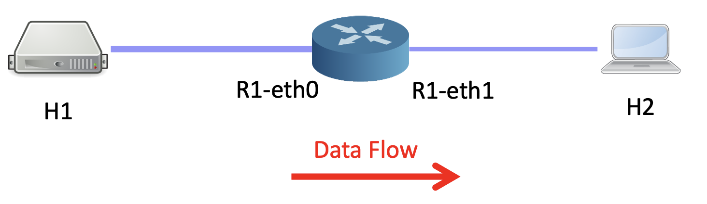
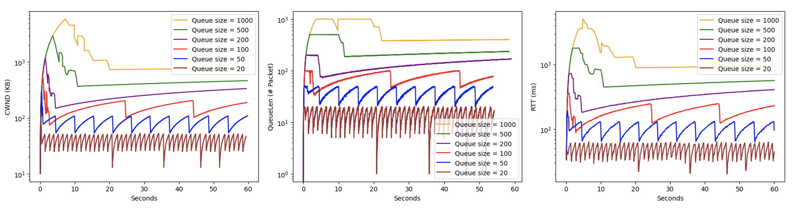
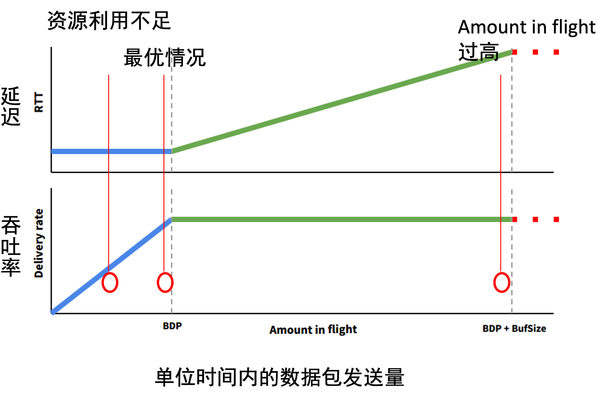

# 实验十实验报告
+ 杨宇恒 2017K8009929034

## 实验面向的现实问题
在路由转发的过程中，路由器会为每个发送端口设置缓冲队列。只是为了在接收有突发的特征，路由器也可以缓冲足够多的数据包，这样，发送链路在接收面突发空隙的时候，也有数据发出，以持续利用发出方向带宽。然而如果缓冲区在达到这一目的之后继续增大，在发送方发送速率较高的时候，路由器缓冲区会一直存在大量数据包排队，这带来了很高的延时。

本实验在假设路由器始终，或者可以转发全部数据包，或者可以充分利用路由发送链路的带宽。在这种情况下，我们可以重点关注路由缓冲区过大产生的负面效果。我们希望重现高延时的出现，并重现TailDrop、CoDel、RED的解决效果，最后对新型解决方案BBR和HPCC进行调研。

## 实验配置
实验使用如下路由结构：

实验过程中H1节点向H2节点高速率发送数据包，通过R1进行转发。在第一部分实验中，我们对路由器中的缓冲队列大小进行调整，观察H1发送窗口大小、R1中队列使用长度、往返延时，他们反映了发送过程中的资源占用情况以及延时。在第二部分实验，我们控制缓冲队列大小，调整H1节点的发送速率，观察往返延时的变化。进一步，我们对比三种解决方案（TailDrop、CoDel、RED）降低延时的效果。

## 代码实现

### 调整实验参数
在`lab10/mininet`文件夹中实现，是代码框架提供的。
+ 路由器中的缓冲队列大小：mininet设置
+ H1节点的发送速率：tc指令

### 测量实验现象
在`lab10/mininet`文件夹中实现，是代码框架提供的。
+ H1发送窗口大小：ss指令
+ R1中队列使用长度：tc指令
+ 往返延时：ping指令

### 数据处理
在`lab10/plotScripts`中实现。其中主要是将实验数据文件读入成我们关心的数组，进而通过matplotlib.pyplot库作图。

### 代码框架中的问题
在初始的代码框架中，通过ping指令测量往返延时的时候，相邻的两次测量会被第一次测量阻塞，甚至如果ping长时间没有返回，下一次往返延时的测量会被永远阻塞下去，进而没有输出数据。为解决这一问题，我使用H1节点直接将ping输出重定向到文件，文件名由monitor的时间戳提供，这样monitor不必实时进行ping输出的处理，而只需在整个仿真结束后，根据文件名所表示的时间戳，对所有重定向文件进行汇总。这部分修改了`lab10/mininet/utils.py`文件中的`rtt_monitor`函数和`stop_rtt_monitor`函数。

## 实验结果
第一部分的结果如下，三幅图片分别为，H1发送窗口大小、 R1中队列使用长度、往返延时：

第二部分的结果如下：

## 两种新型解决方案调研

### BBR
在全球互联网场景下，BBR利用TCP回复机制，并结合现实中RTT主要只受bufferbloat影响的实际情况（在此之前，网络的复杂性带来的噪声被认为是不可忽虑的），建立这样符合实际情况的假设：
+ TCP发送-回复周期变化，表示bufferbloat导致RTT的变化。

这样，根据简单的最大成功传送带宽-RTT关系，为了能够一直找到动态的最优情况，我们只需要这样调整amount in flight，并观察TCP发送-回复周期（代表RTT）变化：
+ 周期性尝试通过提升发送速率以提升amount in flight，若TCP发送-回复周期增加，则说明目前在下图绿色部分，回退刚刚进行的发送速率提升。否则，说明在下图蓝色部分，发送速率提升是应该进行的。
+ 周期性尝试通过降低发送速率以降低amount in flight，若TCP发送-回复周期降低，则说明目前在下图绿色部分，发送速率降低是应该进行的。否则，说明在下图蓝色部分，回退刚刚进行的发送速率降低。

值得注意的是，上面的分析没有利用任何最大成功传送带宽（吞吐率）的观测结果，也就是说，可以认为吞吐率这里理论概念在实际中是难以像RTT一样精确动态观测到的。整体来看，这项研究的关键在于其在google网络中的极大成功与大范围部署。他们的基本模型非常简单，从长远来看，其有效性需要其模型能够实时进行调整，以很好地适应网络。例如上文描述的模型在印度部署后，发现运营商限速因素没有被其模型考虑，导致实际性能下降，因此google对上面的模型进行调整后才形成目前部署的模型。

### HPCC
不同于BBR，HPCC针对数据中心局域网络环境，其不同之处在于，节点之间可以以更低的成本进行通信，并需要达到更加实时的调整与极低的延时，这样，从节点间的详细状态信息中作出拥塞控制，是一个需要细心设计的研究。

整体上，他们复用了In-band network telemetry技术提供的链路状态信息，将链路中总数据包（延迟带宽积中数据包 + 缓冲队列中数据包），与延迟带宽积中数据包的比值，作为发送速率降低因子。进而尽量降低缓冲队列中数据包。但这需要更细致地考虑反馈延时带来的影响，他们发现并解决了两个反馈延时带来的问题：
+ 当链路拥塞时，降速反馈延时很高，导致发送方长时间高速发送数据包：解决方案为，在长时间没有收到一个数据包的反馈时，将发送阻塞直至收到反馈。
+ 对于链路状态，连续的数据包会给出相同的描述，这样，永远根据每个数据包的反馈都进行一定比例的降速是过度的：解决方案为，在链路突发传输特征不强的时候，采用每个一个RTT周期进行一次反馈调整的方法；在链路突发传输特征强的时候，才对每个数据包都进行反馈调整。

