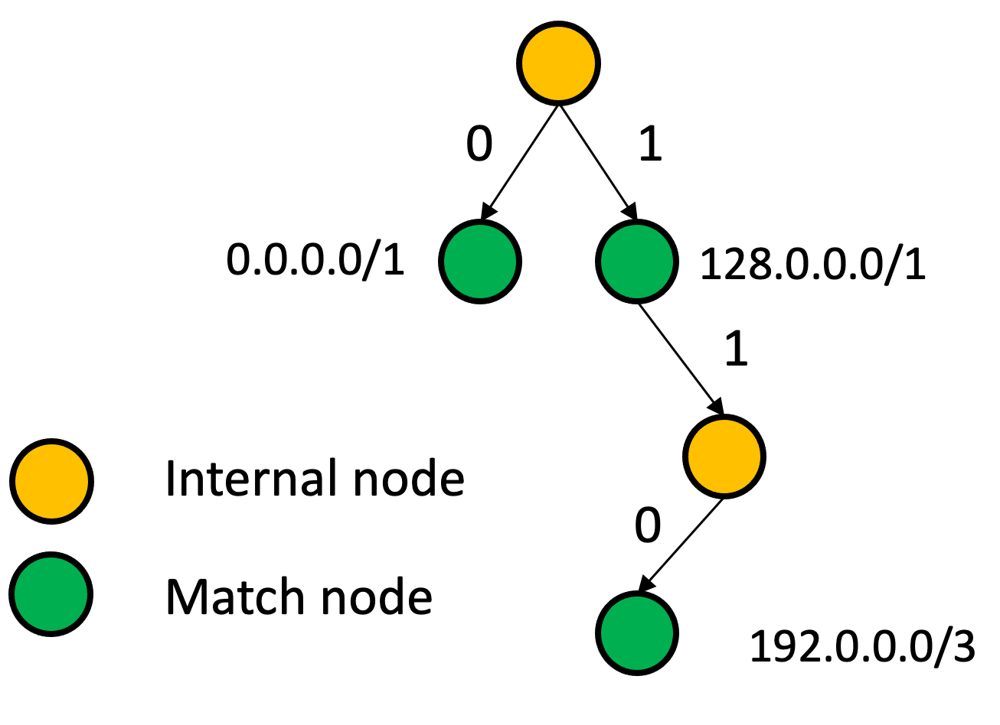
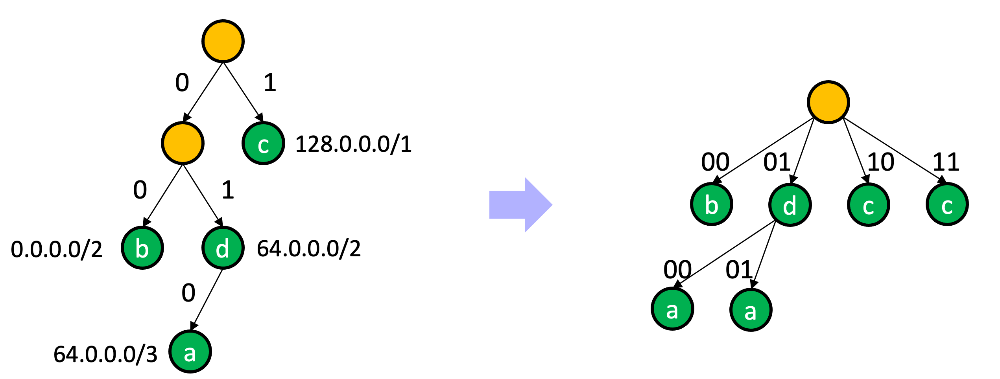
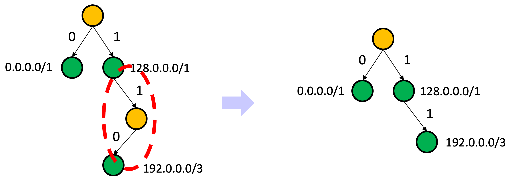
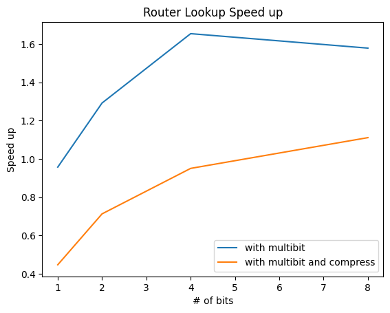
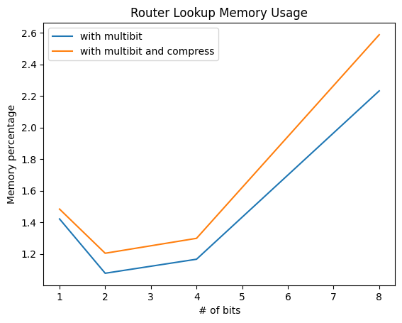

# 实验十一实验报告
+ 杨宇恒 2017K8009929034

## 实验面向的现实问题
为了避免IP路由查找速度成为链路的瓶颈，我们需要快速的IP路由查找算法，前缀树查找是一个很好的方案。

## 实验配置
使用`dataSet/forwarding-table.txt`数据集，包含600,000项路由表项。实验过程中首先建立这个完整的路由表项，之后对每个表项进行查找。

## 代码实现

### 基本前缀树

`src/basePrefixTree.py`实现了基本的，重要函数调用包括`basePrefixTree_c::insertEntry`函数和`basePrefixTree_c::serchIP`函数，分别实现了创建路由表和查找路由表的功能。此外，实现还包括性能测试功能，以及作为其他实现正确性对照的两个功能：
+ 使用`time.time()`库函数记录整个查找时间，使用`hpy().heap()`函数记录堆空间分配情况。
+ 实现`checkWithBase`函数，其他优化前缀树实现调用此函数，对比查找结果的正确性。

### 多比特前缀树

`src/multibitPrefixTree.py`实现了多比特优化，可以将多比特对应的多段路径查找，压缩成一个直接的hash查找，减少内存访问次数。

值得注意的实现细节是，当某个路由表项的mask值不是所采用的比特数的倍数时，它会占用多个节点。因此，占用同一个节点的路由表项可能会有不同的mask值，为了保证最长前缀总是有限比配，当多个路由表项竞争同一个节点的时候，mask值大的表项胜出。

### 压缩的多比特前缀树

`src/compressedMultibitPrefixTree.py`在多比特的基础上，实现了压缩操作。算法首先按照原来的方法建立前缀树，建好之后便利节点并将可以删除的节点进行压缩，这样的节点是可以删除的：
+ 非match节点
+ 并且，其父节点只有它这一个孩子

删除时，需要将其与父节点路径代表的值记录在父节点上，当查找过程中经过这个父节点的时候，先进性记录值的匹配，只有完全匹配才会继续向叶子方向查找。

## 实验数据
针对测试集，我们有两个实验参数：
+ 前缀树每一层的比特数
+ 是否进行压缩算法

我们观测两个性能指标：
+ 加速比，即优化后的查找速度，比上基本前缀树的查找速度，数值越大性能越好
+ 内存占用比例，即优化后的内存使用，比上优化前的内存使用，数值越小性能越好

下面是对两个观测指标的各自作图：

 

可以看到，只有一条曲线代表着性能提升，即左侧的蓝色曲线，其含义是，通过使用多比特前缀树，查找速度提高到了原来的1.5倍左右。下面我们依次解释其他几条曲线没有能够提升性能的原因：

1. 使用首先对于内存进行解释，对于多比特前缀树，那些mask值不是所采用的比特数的倍数的表项，会占用多个节点。
2. 对于压缩前缀树，需要更进一步为每个节点额外记录匹配串，这个匹配串是那些被删除的节点的体现。一个直接的问题是，为什么删除掉一些节点无法节约内存？这是因为经实验，我们发现路由表中可以被删除的节点比例不足7%。然而，为了能够进行节点删除，我们需要为每个节点增加记录匹配串的空间。
3. 对于压缩树无法提升性能的问题，正如前所述，我们仅仅删除了很少的节点，因此无法减少便利距离，然而，由于每个节点占用的空间增大了，我们的整个遍历过程会经过更多的内存空间，需要更多的内存访问。另一方面，我们在遍历的过程中需要不停地进行是否有删除节点的判断，也增加了逻辑开销。

