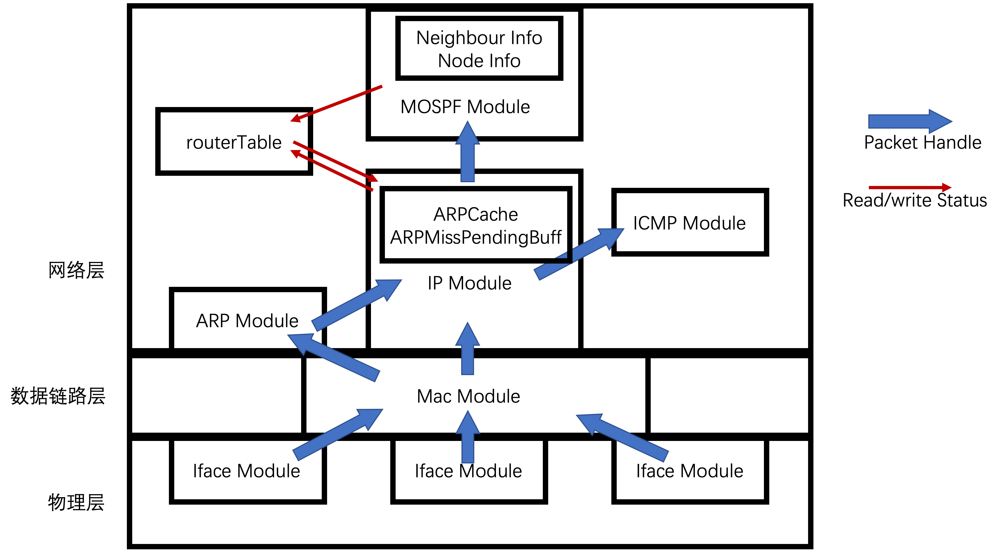
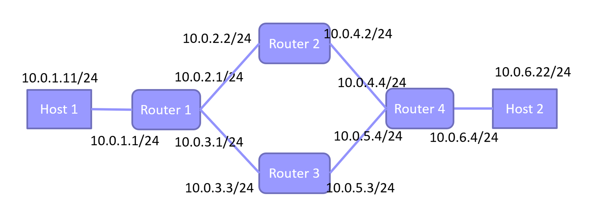

[TOC]

# 实验十二实验报告
+ 杨宇恒 2017K8009929034

**摘要：本实验为了实现路由表的自动配置，在实验七中自己搭建的框架中，进一步增加MOSPF模块。本框架的优势在于Mac层、IP层、MOSPF层、hello/LSU数据报模块的处理相互隔离，进行了清晰的函数接口与分工的定义。最终在测试网络中，成功创建了新的路由表项，并在链路发生变化时，调整路由表项。**

## 实验内容
通过增加mOSPF层协议，使用Hello消息操作，维护邻居节点信息；使用LSU消息操作，构建一致性链路状态数据库。通过dijkstra算法，由链路状态数据库计算路由信息，实现网络路由表的自动配置。

## 顶层架构设计
本实验基于实验七中独立搭建的框架进一步增加`MOSPFPacketModule`，构成如下图的整体结构：

其中，新增接口函数有：
+ `MOSPFPacketModule_c::handlePacket`：当IP层解析出一个MOSPF数据报的时候，会调用此函数，将数据报的处理移交给MOSPF模块。
+ `IPPacketModule_c::sendPacket`：当MOSPF层准备好一个数据报后，会调用此函数，获得IP层为其发包的服务。
+ `routerTable_c::clearMOSPFEntry`与`routerTable_c::addMOSPFEntry`：当MOSPF层计算好新的路由表项时，会调用这个函数加入到路由表中，使其被IP层可见。值得注意的是，由于路由表会变动，MOSPF层会在刷新路由表前清除所有已有表项。

## 内部实现细节

### IP层新增功能
+ `sendPacket`：在发包时，根据IP地址是否为邻居广播地址，为MAC层提供相应的mac邻居广播地址。
+ `handlePacket`：在收包时，根据类型，判断是否要传递给MOSPF层处理。

### MOSPF层功能
1. 维护邻居节点信息
	+ `sendHelloThread`：周期性产生hello数据报，准备向邻居广播自己的存在。
	+ `sendPacket`：为hello或LSU数据报包装MOSPF报头，并调用IP层服务进行发送。
	+ `handlePacket`：从IP层接收数据报，解析MOSPF报头，根据类型调用hello或LSU函数处理报内容。
	+ `handleHello`：解析hello报内容，将邻居信息储存在邻居链表中。
2. 构建一致性链路状态数据库
	+ `sendLSUThread`：周期性读取本节点存储的邻居链表，包装成LSU数据报，调用`sendPacket`向所有节点广播。
	+ `handleLSU`：被`handlePacket`调用，继续解析LSU数据报，将信息存储在节点信息链表中，形成链路状态数据库。当ttl大于零时，调用`sendPacket`转发此LSU数据报。
3. 通过dijkstra算法，配置路由表
	+ `updateRouterTable`：每当链路状态数据库被更新的时候调用（例如被`handleLSU`函数调用）。将数据库数据转换成图表示，调用`dijkstra`算法得到最短路后，转换回路由表项。最后调用路由表对象更新路由表。
	+ `dijkstra.h`：根据图连通情况，计算从根节点通往任意节点的最短路的第一跳节点。
4. 邻居信息与节点链路数据库的超时处理
	+ `neighbourTimeoutThread`：每秒更新邻居信息中每一项的生存时间。若有超时情况，将这个邻居删除，并通知`sendLSUThread`立即发送新的邻居信息。
	+ `nodeTimeoutThread`：每秒更新节点数据库中每一项的生存时间。若有超时情况，将这个节点信息删除，并通知`updateRouterTable`立即更新路由表。

### 路由表新增功能
+ `addMOSPFEntry`：由于节点链路数据库中没有储存Iface信息，这里这样查找为了到达下一跳所需的Iface：由于路由表中对于所有下一跳都有初始化好的路由表项，我们只需要查找路由表来判断下一跳需要的Iface。这样，我们就将节点链路数据库中的下一跳IP转换成了完整的路由表项。
+ `clearMOSPFEntry`：在更新路由表的时候，删除所有由MOSPF之前生成的路由表项。

### 需要进一步改进的部分
目前的顶层结构造成了这样的不合理之处：我们的Iface信息必须要从mac层一直传送到MOSPF层，并且，这个信息也会一路从上传到下。这增加的接口的复杂性。
可以从顶层结构上进行的改进是：为每个Iface赋予相应的Mac、IP、MOSPF层，而不是使用统一的Mac、IP、MOSPF层。其合理之处在于，对于每个Iface有很多内容都是独立进行处理的，而只有在涉及路由表等全局信息的时候才会进行交互，于是这种设计可以见效模块间的交互，获得更简洁的顶层抽象。

## 实验测试

### 环境配置
测试中采用的网络结构如下图：

### 实验测试过程
+ 在初始化时，R1没有通往H2的路由表项，通过MOSPF协议的上述实验，这个路由表项在测试中被建立。一致性节点链路数据库、和路由表项被打印到`./result/STEP1-r*.txt`中。
+ 通过H1项H2发送`traceroute`请求，我们可以测试链路的连通性。结果被打印到`./result/STEP2-firstPing.txt`中。
+ 现在我们测试路由表是否可以随着链路状态的变化而变化。我们切断上一步的传输路径中的R2-R4链路，之后重新发送H1到H2的`traceroute`请求，这样，R1应当选择R3作为下一跳路由。结果被打印到`./result/STEP2-secondtPing.txt`中。

## 总结
本实验为了实现路由表的自动配置，在实验七中自己搭建的框架中，进一步增加MOSPF模块。本框架的优势在于Mac层、IP层、MOSPF层、hello/LSU数据报模块的处理相互隔离，进行了清晰的函数接口与分工的定义。最终在测试网络中，成功创建了新的路由表项，并在链路发生变化时，调整路由表项。此外，可进一步进行的优化是：为每个Iface赋予相应的Mac、IP、MOSPF层，这样可以把不涉及Iface交互的处理独立进行，带来更好的模块抽象。
