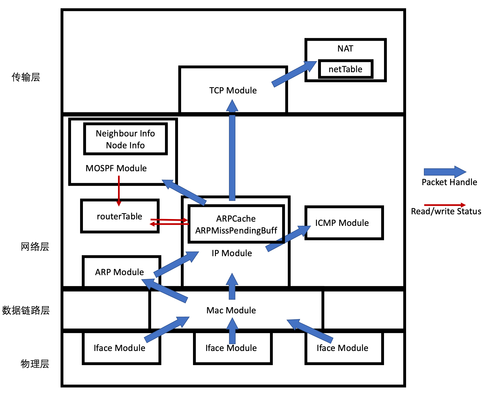
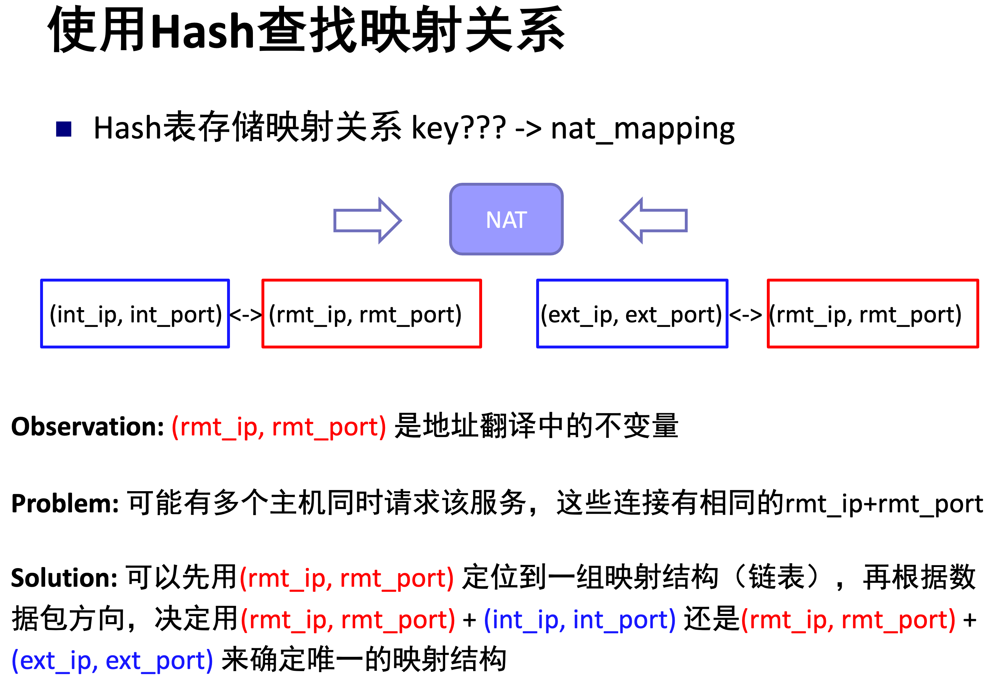
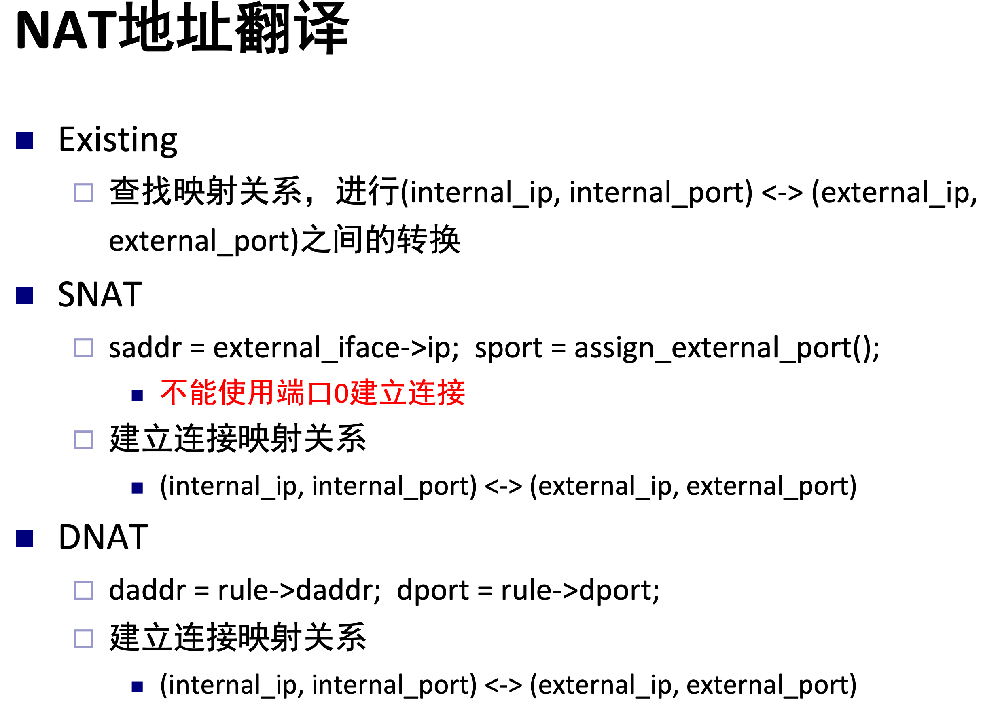
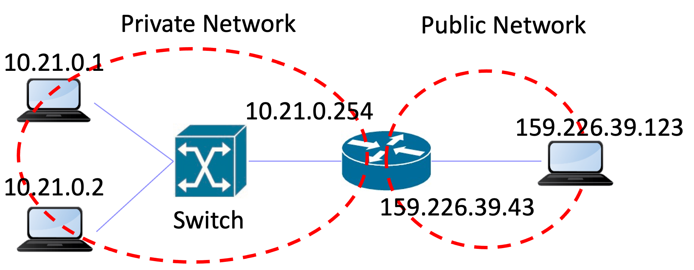
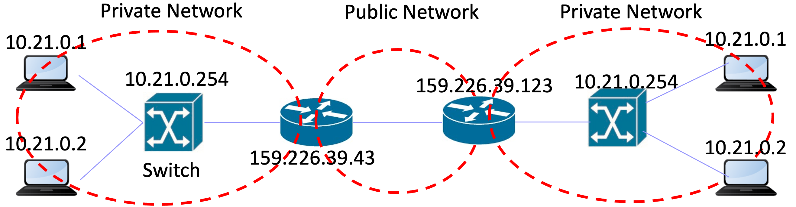

[TOC]

# 实验十三实验报告
+ 杨宇恒 2017K8009929034

**摘要：本实验为了实现NAT，在实验十二中自己搭建的框架中，进一步增加TCPModule模块和NAT模块。特别的，为了实现简洁（虽然不高效），我们将NAT放到TCPModule的上层以复用其中报头解析和校验和逻辑。最终在测试网络中，我们观察到了1）公网主机可以通过NAT的IP地址访问私网中不同主机。2）私网主机成功接收到了以NAT的IP地址为目的IP的数据报。3）前两条保证了，相同的私网IP地址可以出现不同的私网中。**

## 实验内容
实现NAT。它根据配置好的地址转换规则，在TCP请求建立时，实时对私网对公网、公网对私网的TCP请求进行地址转换。具体来说，通过TP/TCP报头解析，获取数据报原始的IP/TCP地址，之后查找转换缓冲，如果命中，则进行转换；否则，需要先根据地址转换规则，创建新的转换缓冲，进行转换。同时，转换缓冲会清除过久没有使用的条目。

## 顶层架构设计
本实验基于实验十二中独立搭建的框架进一步增加`TCPPacketModule`和`nat`，构成如下图的整体结构：（Surprise？我们将NAT放到了传输层中，这是考虑到在数据报处理流程上，NAT模块需要TCP报头解析的服务）



其中，新增接口函数有：
+ `TCPPacketModule_c::handlePacket`：当IP层的数据报需要TCP报头解析并进行后续处理的时候，会调用此函数，将数据报的处理移交给TCP模块。
+ `IPPacketModule_c::sendPacket`：当TCP层准备好一个数据报后，会调用此函数，获得IP层为其发包的服务。
+ `nat_c::translate`：当TCP模块调用这个函数进行IP/TCP地址转换，并转发。

此外，我们在结构图中单独设置NAT方框是有一定的不一致性的。因为所有其他单独的方框（如ICMP Module），都是有其特定的报头的，然而我们并没有NAT报头。但将NAT单独画一个方框可以更好地体现清晰的模块划分。

## 内部实现细节

### IP层更改
+ `handlePacket`：在收包时，禁用原来的所有处理，解析报头后，直接向上提供给TCP层处理。如果TCP转换失败，向上提供给ICMP进行主机不可达报告。

### TCP层功能
+ `handlePacket`：解析报头后，直接提供给NAT模块处理。
+ `sendPacket`：除了常规的调用IP发包以外，校验和需要特别的虚拟报头。

### NAT功能
+ `nat_c`（构造函数）：从配置文件读入地址转换规则。
+ `translate`：进行地址转换。数据结构是`map<pair<IPAddr_t, TCPPort_t>, list<natMap_t>> netTable`，组织形式如下面左图。处理算法逻辑如下面右图。

                  

+ `tableTimeoutThread`：每秒进行`netTable`老化操作，删除60s内没有使用的条目。

### 需要进一步改进的部分
没有实现TCP链接结束后的条目删除，因为这涉及了TCP协议细节，会在后面对TCP细节有更好理解的时候补充。

## 实验测试

### 环境配置
1. 测试中前两部分采用的网络结构和地址转换规则如下：



```
internal-iface: n1-eth0
external-iface: n1-eth1
dnat-rules: 159.226.39.43:8000 -> 10.21.0.1:8000
dnat-rules: 159.226.39.43:8001 -> 10.21.0.2:8000
```

2. 最后一部分的网络结构和地址转换规则如下：



```
# Left Nat
internal-iface: n1-eth0
external-iface: n1-eth1
dnat-rules: 159.226.39.43:8000 -> 10.21.0.1:8000
dnat-rules: 159.226.39.43:8001 -> 10.21.0.2:8000
```

```
# Right Nat
internal-iface: n2-eth1
external-iface: n2-eth0
dnat-rules: 159.226.39.123:8000 -> 10.21.0.1:8000
dnat-rules: 159.226.39.123:8001 -> 10.21.0.2:8000
```

### 实验测试过程
1. STEP1: 两个私网主机向公网主机发起`wget`请求，结果输出到`./result/STEP1-h1client-index.html`和`./result/STEP1-h2client-index.html`中，分别为：

```html
#./result/STEP1-h1client-index.html
<!doctype html> 
<html>
	<head> <meta charset="utf-8">
		<title>Network IP Address</title>
	</head>
	<body> 
            My IP is: 159.226.39.123 
            Remote IP is: 159.226.39.43
        </body>
</html>
```

```html
#./result/STEP1-h2client-index.html
            My IP is: 159.226.39.123 
            Remote IP is: 159.226.39.43
```

可见，在公网主机看来，两个私有主机的IP地址是相通的NAT的IP地址。

2. STEP2: 公网主机向两个私网主机发起`wget`请求，结果输出到`./result/STEP2-h3clientToh1-index.html`和`./result/STEP2-h3clientToh2-index`中，分别为：

```html
#STEP2-h3clientToh1-index.html
            My IP is: 10.21.0.1 
            Remote IP is: 159.226.39.123
```

```html
#./result/STEP2-h3clientToh2-index
            My IP is: 10.21.0.2 
            Remote IP is: 159.226.39.123
```

可见，私网主机可以成功看到公网发来的请求，这是通过NAT地址转化实现的。

3. STEP3: 右侧私网两个主机分别向两个私网主机发起`wget`请求，结果输出到`./result/STEP3-h3clientToh1-index.html & ./result/STEP3-h3clientToh2-index.html`（右上主机结果）和`./result/STEP3-h4clientToh1-index.html & ./result/STEP3-h4clientToh2-index.html`（右下主机结果）中，分别为：

```html
#./result/STEP3-h3clientToh1-index.html & ./result/STEP3-h3clientToh2-index.html
            My IP is: 10.21.0.1 
            Remote IP is: 159.226.39.123
            
            My IP is: 10.21.0.2 
            Remote IP is: 159.226.39.123
```

```html
#./result/STEP3-h4clientToh1-index.html & ./result/STEP3-h4clientToh2-index.html
            My IP is: 10.21.0.1 
            Remote IP is: 159.226.39.123
            
            My IP is: 10.21.0.2 
            Remote IP is: 159.226.39.123
```

可见，NAT转换成功的是的私网地址，可以在不同的私网中重复使用。

## 思考题
实验中的NAT系统可以很容易实现支持UDP协议，现实网络中NAT还需要对ICMP进行地址翻译，请调研说明NAT系统如何支持ICMP协议。

TCP和UDP可以轻松实现地址转换的关键在于端口号的存在，然而，在ICMP协议中，并没有端口号的概念。于是，为了实现ICMP地址转化，参考[RFC 792](https://tools.ietf.org/html/rfc792)第16页，我们可以使用ICMP头中的一部分作为源/目的端口号来使用。

具体来说，ICMP发送方把Sequence Number作为源端口号，而Identifier作为目的端口号。经过NAT时，NAT会记录下这个个数据报的源/目的端口号和IP地址，并重新填充源端口号（Sequence Number）和源IP地址。当目标收到并回复的时候，会将收到的数据报的发送方端口号（Sequence Number）作为新数据报的目的端口号（Identifier）；并将收到的数据报的目的方端口号（Identifier）作为新数据报的发送端口号（Sequence Number）。之后，回复数据报到达NAT时，会进行目的IP和Port转换，这是和NAT进行TCP/UDP转换相同的机制。

## 总结
本实验为了实现NAT，在实验十二中自己搭建的框架中，进一步增加TCPModule模块和NAT模块。特别的，为了实现简洁（虽然不高效），我们将NAT放到TCPModule的上层以复用其中报头解析和校验和逻辑。最终在测试网络中，我们观察到了1）公网主机可以通过NAT的IP地址访问私网中不同主机。2）私网主机成功接收到了以NAT的IP地址为目的IP的数据报。3）前两条保证了，相同的私网IP地址可以出现不同的私网中。
