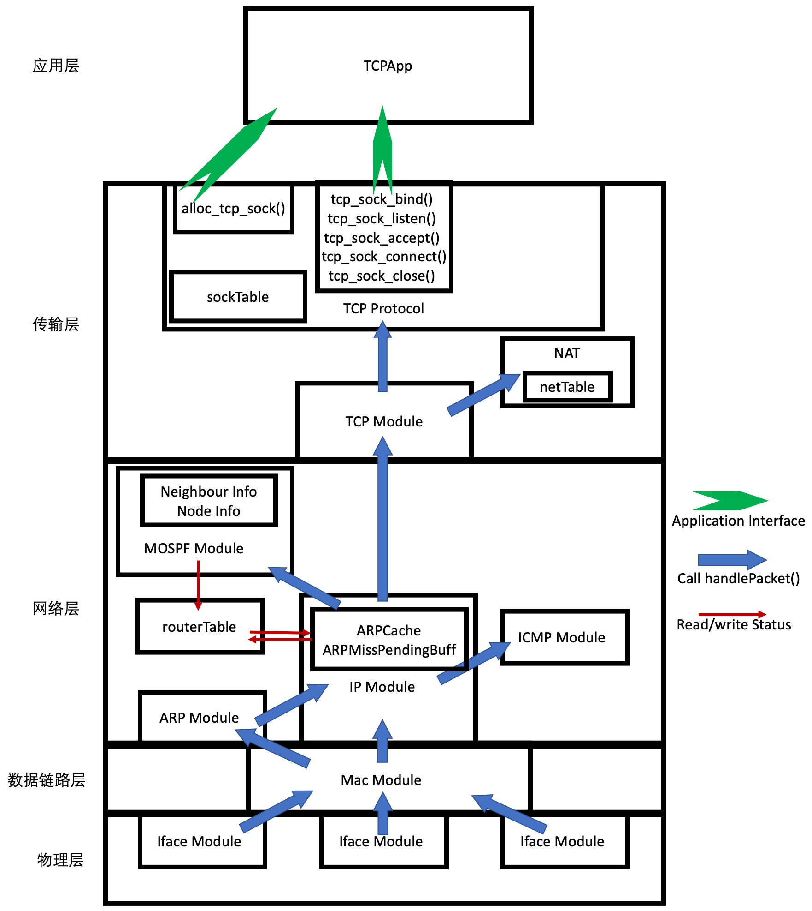

[TOC]

# 实验十五实验报告
+ 杨宇恒 2017K8009929034

**摘要：本实验为了实现无丢包情况下的TCP链路的建立和释放，在实验十三中自己搭建的框架基础上，进一步增加TCPProtocol和TCPApp模块。最终在测试网络中，我们观察到了我们的实现之间可以正常建立和释放TCP连接，我们的实现也可以和python库实现正常建立和释放TCP连接。**

## 实验内容
实现无丢包情况下的TCP链路的建立和释放。它实现了TCP建立的3/4次握手以及TCP释放的3/4次握手所需传输的数据报。对于通信的双方，需要维护自身观点下的TCP链路的状态。额外的，设计框架理论上应该支持服务段同一程序，可以与多个其他节点同时建立TCP链路，虽然没有针对这一点进行严格正确性的测试。

## 顶层架构设计
本实验基于实验十三中独立搭建的框架进一步增加`TCPProtocol`和`TCPApp`模块，构成如下图的整体结构：

其中，新增或大幅修改的接口函数有：
+ `TCPProtocol_c::handlePacket`：当TCP层的数据报头被`TCPPacketModule_c`根据地址偏移解析后，它会调用这个函数。这个函数根据报头内容进行处理，并对TCP数据报内容进行读取。
+  `TCPProtocol_c::alloc_tcp_sock`, `TCPProtocol_c::tcp_sock_bind`, `TCPProtocol_c::tcp_sock_listen`, `TCPProtocol_c::tcp_sock_accept`, `TCPProtocol_c::tcp_sock_connect`, `TCPProtocol_c::tcp_sock_close`：他们是提供给应用层的接口函数，与人们对这些函数的一般约定功能相符。
+ `TCPPacketModule_c::sendPacket`：当`TCPProtocol_c`决定需要发送的TCP报内容以及报头内容后，会调用此函数。这个函数根据地址偏移对报头进行填充、计算校验和、并调用下层发报服务。

## 内部实现细节

### TCPPacket模块更改
+ `sendPacket`：实验十三中我们仅仅进行了转发，因此当时直接将源报头复制进了新的报头。本实验中，这一函数增加了`seq`, `ack`, `flag`, `rwnd`参数的传入，并根据这些参数对新报头进行填充。

### TCPProtocol模块内的数据结构
+ `listenTable`与`establishedTable`：它储存了所有的链路信息，具体来说，它是一个套接字到`struct tcp_sock`结构体的map。第一个表中储存了`LISTEN`, `SYN_SENT`, `SYN_RCVD`状态的tcp链路结构体；第二个表中储存了`ESTABLIDHED`, `FIN_WAIT_1`, `CLOSE_WAIT`, `FIN_WAIT_2`, `LAST_ACK`, `TIME_WAIT`状态的tcp链路结构体。值得注意的是，我们没有实现`bindTable`，因为他在我们的要求中意义不大，我们就忽略它以使得实现更为简单。
+ `struct tcp_sock`结构体，它储存一个链路的信息，其的各个域为：
	+ `TCPState`：TCP链路当前状态。
	+ `localAddr, peerAddr`：TCP链路双方的套接字。
	+ `synRcvdList, acceptList`：只在服务器的父tcp_sock中有效。服务器TCP的父tcp_sock始终处在`LISTEN`状态，并阻塞应用程序自身，当它收到了某个客户端的链接建立请求后，一个子tcp_sock会被初始化并暂存在`synRcvdList`中。当链接建立后，这个子tcp_sock会被转移到`acceptList`中。这时，`acceptList`非空便是应用程序的唤醒条件，应用程序将这个子tcp_sock转移到`establishedTable`中，完成子tcp_sock的建立。值得注意的是，父子tcp_sock并不代表父子进程，我们主要只有两个进程，应用程序进程和收报进程。
		另外值得注意的是，我们的子tcp_sock在`ESTABLIED`后，就被移出了`acceptList`，因此父tcp_sock并不知道有哪些子tcp_sock存在，这会导致父tcp_sock被终止时，无法进一步终止其所有子tcp_sock。为实现完整的父子tcp_sock支持，还需要一些细节实现。我们没有进行这些实现的主要原因是：这些实现有很多细节，需要一个验证环境才能更好的保证实现的正确性；然而，我们并没有准备对多个客户端的同时链接进行验证，因此，我们没有对其实现。
	+ `timeWait`：当链路处在`TIME_WAIT`状态时有效，这是一个计时器。

### TCPProtocol模块内的函数
+ `handlePacket()`：此函数被`IPPacketModule_c::handlePacket`调用，传入参数包括`seq`, `ack`, `flag`, `rwnd`等。它根据目前的TCP链路状态，以及传入参数，判断需要进行的处理和状态机转换（如下图）。不同的处理和状态机转换的实际工作，由下述私有子函数实现：

| 函数名       | 状态转换的描述                                               | 状态转换的触发条件                                           | 处理                                                         |
| ------------ | ------------------------------------------------------------ | ------------------------------------------------------------ | ------------------------------------------------------------ |
| handleSYN1() | 服务器在LISTEN状态时，收到第一次握手数据报，转换到STN_RCVD状态。 | State == LISTEN                                              | 记录`seq`，记录链路对端套接字，发送第二、三次握手数据报，初始化针对这一连接的子TCP并放入`synRcvdList`中。 |
| handleSYN2() | 客户端在SYN_SENT状态时，收到第二次握手数据报，保持在SYN_SENT状态。 | State == SYN_SENT && (flags & ACK)                           | 记录`ack`。                                                  |
| handleSYN3() | 客户端在SYN_SENT状态时，收到第三次握手数据报，转换到ESTABLISHED状态。 | State == SYN_SENT && (flags & SYN)                           | 记录`seq`，发送第四次握手数据报。                            |
| handleSYN4() | 服务器在SYN_RCVD状态时，收到第四次握手数据报，转换到ESTABLISHED状态。 | State == SYN_RECV                                            | 记录`ack`, `seq`。将子TCP移到`acceptList`中。                |
| handleFIN1() | 被动断开方在ESTABLISHED状态时，收到第一次握手数据报，转换到CLOSE_WAIT状态。 | State == ESTABLISHED && !(flags & FIN)                       | 记录`ack`, `seq`。发送第二、三次握手数据报。                 |
| handleFIN2() | 主动断开方在FIN_WAIT_1状态时，收到第二次握手数据报，转换到FIN_WAIT_2状态。 | State == FIN_WAIT_1                                          | 记录`ack`。                                                  |
| handleFIN3() | 主动断开方在FIN_WAIT_2状态时，收到第三次握手数据报，转换到TIME_WAIT状态。 | (State == FIN_WAIT_1 \|\| State == FIN_WAIT_2) && (flags & FIN) | 记录`seq`，发送第四次握手数据报。                            |
| handleFIN4() | 被动断开方在CLOSE_WAIT状态时，收到第四次握手数据报，转换到LAST_ACK状态。 | State == LAST_ACK                                            | --                                                           |

+ `timeWaitThread()`：检查`timeWait`计时器，将等候完的TCP链路关闭。
+ 应用程序接口：

| 函数名             | 功能                                                         |
| ------------------ | ------------------------------------------------------------ |
| alloc_tcp_sock()   | 初始化新的`struct tcp_sock`结构体并将其返回。                |
| tcp_sock_bind()    | 设置TCP链路的本端TCP端口。                                   |
| tcp_sock_listen()  | 将TCP链路的本端IP地址与TCP端口绑定。                         |
| tcp_sock_accept()  | 阻塞自身应用进程，等到父tcp_sock将已经`ESTABLISHED`的子tcp_sock放入`acceptList`中后被唤醒。简单其间，使用`while(acceptList.size() == 0);`进行阻塞。 |
| tcp_sock_connect() | 初始化套接字对。将tcp_sock放入`listenTable`。发送第一次握手数据报。阻塞自身直到自己变成`ESTABLISHED`状态。 |
| tcp_sock_close()   | 我们仅仅实现在`ESTABLISHED`状态调用次函数。发送第一次握手信号，阻塞自身直到`timeWaitThread()`将其状态改为`CLOSED`。 |

### TCPApp模块
简单起见，我们没有对所有网络栈进行封装以使得应用程序可以作为main函数初始化所有网络栈。我们仍然让原来的main函数初始化整个网络栈中的各个模块，之后将`TCPProtocol`模块和`TCPApp`模块用指针互联，以让他们可以互相调用。但当我们实现不同的应用时，仍可以简单地更改`./src/TCPApp.cpp`中的函数。
我们先后实现了客户端向服务器发送短字符串并回显的应用，以及客户端向服务器发送长字符串文件（4MB）的应用。

## 实验测试

### 环境配置
实验中的拓扑为两个主机节点直接相连。我们对TCP链路建立和释放进行三次次实验，使用wireshark观察数据报传输情况。三次实验的两端分别满足：
1. 服务端使用我的C++实现，客户端使用我的C++实现。
2. 服务端使用我的C++实现，客户端使用ref python库。
3. 服务端使用ref python库，客户端使用我的C++实现。

### 实验测试过程
实验通过运行`./run_all.sh`完成，所有数据结果储存在`./result`文件夹中。其中STEP1-3开头的文件对应我们的三次实验对于每次实验，我们打开`*-wiresharkOutput-*.pcapng*`文件观察结果：

1. 服务端使用我的C++实现，客户端使用我的C++实现。

2. 服务端使用我的C++实现，客户端使用ref python库。

3. 服务端使用ref python库，客户端使用我的C++实现。

## 总结
本实验为了实现无丢包情况下的TCP链路的建立和释放，在实验十三中自己搭建的框架基础上，进一步增加TCPProtocol和TCPApp模块。最终在测试网络中，我们观察到了我们的实现之间可以正常建立和释放TCP连接，我们的实现也可以和python库实现正常建立和释放TCP连接。
