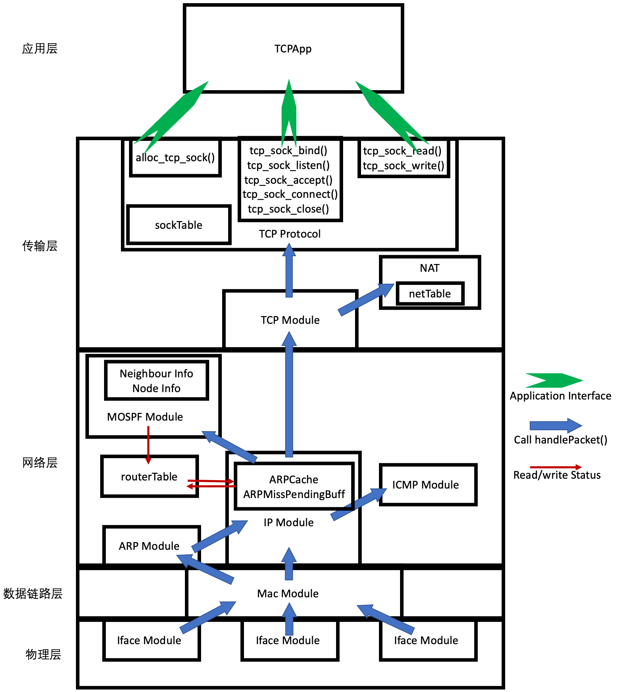
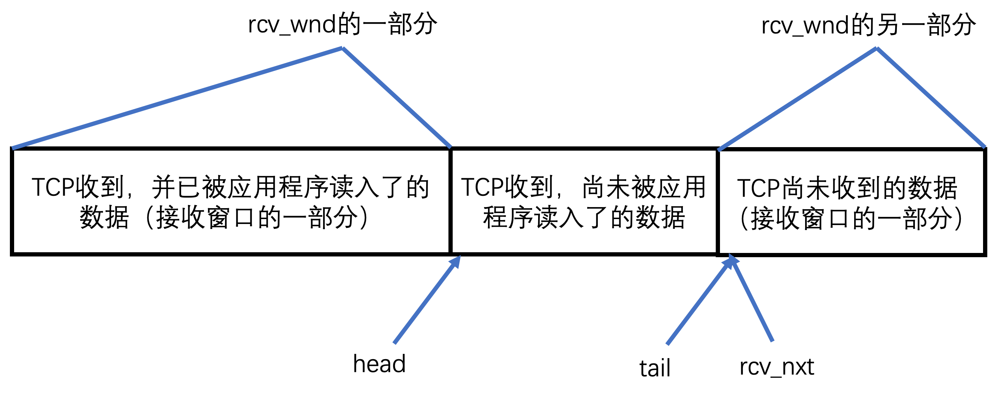
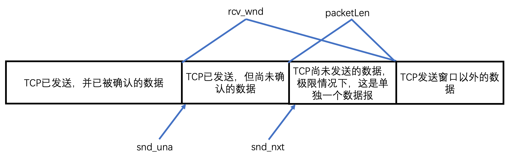

[TOC]

# 实验十六实验报告
+ 杨宇恒 2017K8009929034

**摘要：本实验为了实现无丢包情况下的TCP链路的数据传输，在实验十五中自己搭建的框架中，进一步增加了`TCPProtocol`模块的`tcp_sock_read`和`tcp_sock_write`接口。最终在测试网络中，我们在回显程序中观察到了字符串被正常回显；在文件传输程序中验证了发送文件和接收文件是相同的。**

## 实验内容
实现无丢包情况下的TCP链路的数据传输。它实现了应用程序的`tcp_sock_read`和`tcp_sock_write`接口进行数据传输。其中，读缓存使用TCP协议栈自己分配的环形缓存实现；写缓存由应用程序提供。

## 顶层架构设计
本实验基于实验十五中独立搭建的框架进一步增加`TCPProtocol`模块的`tcp_sock_read`和`tcp_sock_write`接口，构成如下图的整体结构：



其中，新增或大幅修改的接口函数有：
+  `TCPProtocol_c::tcp_sock_write`：将应用程序缓存中的数据通过TCP发出，传输全部完成后返回。
+ `TCPProtocol_c::handlePacket`：上一个实验这一函数只会处理四次握手的数据报，本次实验增加处理含有数据的数据报的功能，将数据存入TCP缓存中。
+  `TCPProtocol_c::tcp_sock_read`：阻塞应用进程直到获取到任何TCP数据，之后将数据从TCP缓存读入应用程序缓存并返回读入的字节数。当TCP连接断开时返回0.

## 内部实现细节

### TCPProtocol模块内的数据结构
+ 接收缓冲与待应用程序读入的缓冲由同一个`ringBuffer`实现。主要的缓冲数组有`buf`和`filled`，分别存入数据和是否有效的布尔值。当TCP收到数据报时数据变为有效，当数据被应用程序读入后变为无效。主要的指针有：`head`, `tail`,`rcv_nxt`；接收窗口大小为`rcv_wnd`。他们的含义如下图：



  值得注意的，最左侧和最右侧的矩形其实是一部分，当数据被应用程序读入后，就可以用来从TCP接收数据了。另外，接收窗口的大小根据应用程序的读入速度动态变化。

+ 发送窗口有两个重要的指针：`snd_una`和`snd_nxt`。分别是最新接收到的`ack`值，和下一次将发送的`seq`值。如果下一次发送的数据报中有效字节数为`packetLen
`则，根据发送窗口的约束，始终应满足：`snd_nxt` + `dataLen` <= `snd_una` + `rcv_wnd`。其中`rcv_wnd`为接收方的接收窗口大小。取等的极限情况如下图：



### TCPProtocol模块内的函数 

+ `ringBuffer_t::readFromBuffer(char* dest, uint32_t sourceIndex, int len)`：从应用程序ringBuffer中读取数据，dest为应用程序buffer，sourceIndex为ringBuffer中开始读取的索引，对buffer.size取模后使用。同时，因为应用程序读出数据后ringBuffer空间可以释放，会清除filled位。
+ `ringBuffer_t::writeToBuffer(uint32_t destIndex, char* source, int len)`：协议栈根据收到的数据报向ringBuffer中写入数据，并置filled位。值得注意的是，这两个ringBuffer读写函数没有更改ringBuffer的head/tail指针，这是因为将这两个指针与划动窗口指针一起维护逻辑更清晰。
+ `tcp_sock_read(tcp_sock* tsk, char* buf, int len)`：应用程序读取TCP数据。首先如果发现当前连接为`CLOSED`，会直接返回零，否则自旋直到ringBuffer中有数据提供给应用程序。这部分数据是在`head`指针到`tail`指针之间的数据，数据会被堵到应用程序buf中并更新`head`指针指向`tail`。由于应用程序释放了其在ringBuffer中的空间，ringBuffer中接收窗口大小增加，发送TCP数据报告知对方新的接收窗口大小。
+ `tcp_sock_write(struct tcp_sock* TCPSock, char* buff, int len)`：应用程序通过TCP发送数据。他将应用程序buff中的全部内容切割成1514大小进行发送，并更新滑动窗口大小和相关指针。
+ `handleSaveData()`：当`handlePacket()`接口函数发现收到的TCP报含有数据的时候，会调用本函数处理。它根据seq将数据存入ringBuffer，更新接收窗口指针，值得注意的是，只有发现连续的seq空间被填满时，才会将`tail`和`rcv_nxt`同时更新。根据ack更新接收窗口指针。最后如果收到的数据报中含有数据，还有进行ack回复。

## 实验测试

### 环境配置
实验中的拓扑为两个主机节点直接相连。我们为字符串回显和文件传输两个应用各自进行四次实验。四次实验的两端分别满足：
1. 服务端使用我的C++实现，客户端使用我的C++实现。
2. 服务端使用我的C++实现，客户端使用ref python库。
3. 服务端使用ref python库，客户端使用我的C++实现。
4. 服务端使用ref python库，客户端使用ref python库。

### 实验测试过程
实验通过运行`./run_all.sh`完成，所有数据结果储存在`./result`文件夹中。其中STEP1-4开头的文件对应字符串回显应用的四次实验；STEP5-8开头的文件对应文件传输应用的四次实验。对于每次实验，我们有这些数据：
+ `{my,ref}H1Server.txt`和`{my,ref}H2Client.txt`两个文件是两端应用程序的输出。打印出了连接建立、断开的过程，以及传输的数据或数据大小。
+ `tsharkOutput-{my,ref}H1Server.log`和`tsharkOutput-{my,ref}H2Client.log`两个文件是tshark抓包程序的数据，不包含数据，只显示了数据报个数。
+ `wiresharkOutput-{my,ref}H1Server.pcapng`和`wiresharkOutput-{my,ref}H2Client.pcapng`是可以用wireshark打开查看的文件，记录了每个数据包的内容。
+ `diff.txt`：这是对入文件传输程序中，发送文件和接收文件使用`diff`命令比较的输出。有三种可能的结果：
	+ 文件不存在报错：接收方没有将收到的数据存入文件。
	+ 显示出文件的不同：发送文件和接收文件不同。
	+ 无输出：发送文件和接收文件相同，发送成功。

下面我们简单总结重要的实验结果：

1. 字符串回显程序，四组实验的客户端回显结果都为：

```
server echoes: 0123456789abcdefghijklmnopqrstuvwxyzABCDEFGHIJKLMNOP
server echoes: 123456789abcdefghijklmnopqrstuvwxyzABCDEFGHIJKLMNOPQ
server echoes: 23456789abcdefghijklmnopqrstuvwxyzABCDEFGHIJKLMNOPQR
server echoes: 3456789abcdefghijklmnopqrstuvwxyzABCDEFGHIJKLMNOPQRS
server echoes: 456789abcdefghijklmnopqrstuvwxyzABCDEFGHIJKLMNOPQRST
server echoes: 56789abcdefghijklmnopqrstuvwxyzABCDEFGHIJKLMNOPQRSTU
server echoes: 6789abcdefghijklmnopqrstuvwxyzABCDEFGHIJKLMNOPQRSTUV
server echoes: 789abcdefghijklmnopqrstuvwxyzABCDEFGHIJKLMNOPQRSTUVW
server echoes: 89abcdefghijklmnopqrstuvwxyzABCDEFGHIJKLMNOPQRSTUVWX
server echoes: 9abcdefghijklmnopqrstuvwxyzABCDEFGHIJKLMNOPQRSTUVWXY
Close a TCP, closed by this side.
```

2. 文件传输程序，`diff.txt`文件均无报错，并未打印文件的不同。说明文件相同，发送成功。

## 总结
本实验为了实现无丢包情况下的TCP链路的数据传输，在实验十五中自己搭建的框架中，进一步增加了`TCPProtocol`模块的`tcp_sock_read`和`tcp_sock_write`接口。最终在测试网络中，我们在回显程序中观察到了字符串被正常回显；在文件传输程序中验证了发送文件和接收文件是相同的。
