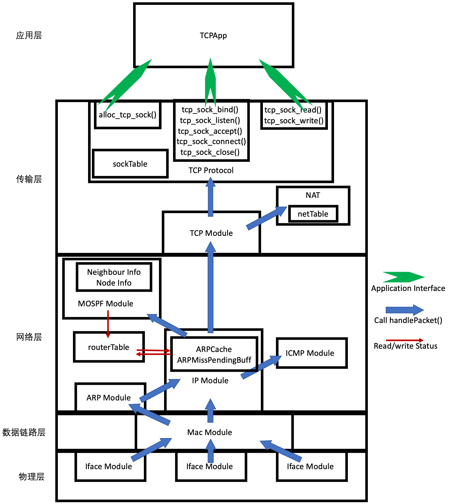

[TOC]

# 实验十七实验报告
+ 杨宇恒 2017K8009929034

**摘要：本实验为了实现有丢包情况下的TCP链路建立释放和数据传输，在实验十六中自己搭建的框架中，进一步增加了发送队列和超时重传机制。最终在测试网络中，我们在文件传输程序中验证了发送文件和接收文件是相同的。**

## 实验内容
实现有丢包情况下的TCP链路建立释放和数据传输。它实现了TCP数据报发送方将数据报缓存，若收到ack，清除缓存；若超时为收到ack重传数据报。

## 顶层架构设计
本实验的顶层框架与实验十六相同，整体结构如下：

## 内部实现细节

### TCPProtocol模块内的数据结构
+ `std::list<TCPPacketInfo_c> sendBuffer`：这个list中储存了所有未收到回复的数据报，按照seq顺序保存。每个表项是下属数据结构：
	+ `char* logPacket`：发送的数据报内容。
	+ `int logPacketLen`：发送的数据报内容长度。
	+ `uint32_t logSeq`：发送的数据报序列号。
	+ `uint8_t logFlags`：发送的数据报flags位。
	值得注意的是，这个数据结构没有储存报头的全部信息，只储存了序列号和flags。这是因为其他数据要么在整个连接中不会改变（如套接字），要么需要实时更新（如ack、接收窗口大小）。
+ `bool timingOpen`：他表示超时重传计时器是否开启。实际上，它在任何时刻都与`sendBuffer`是否为空的逻辑值相反。我们额外维护这个数据可以更好的debug。
+ `uint32_t ACKTimeOut`和`uint32_t ACKPendingTime`：他们分别表示等候ack多久开始按照超时处理，以及当前等候ack的时间，以ms为单位。

### TCPProtocol模块内的函数 
+ `TCPPacketInfo_c::sendAndLogPacket`：它将tcp数据报通过下层发送，并记录超时重传所需的数据。具体来说，读入数据，并把它储存在两个拷贝中，他们是发送数据报的拷贝和超时重传记录的拷贝。调用下层服务发送数据报。记录超时重传报头信息。如这是`sendBuffer`中第一条记录，打开计时器。
+ `TCPPacketInfo_c::resend`：它对一条超时重传记录进行重传。具体来说，它将超时重传记录拷贝到新的空间来发送。之后调用下层服务发送数据报。
+ `handlePacket_handleACK(tcp_sock* TCPSock, uint32_t ack)`：它被`handlePacket()`调用，根据每个数据报的ack对`sendBuffer`中表项进行清除。具体来说，它从表头开始遍历链表，对每一项检查seq是否应该已经被ack，在发现第一个没有ack的表项后停止遍历。
+ `ACKTimeOutThread()`：这个单独的进程检查`sendBuffer`，如果其中有超时的表项，将数据报重传。同时重置`ACKPendingTime`并将`ACKTimeOut`加倍。

## 实验测试

### 环境配置
实验中的拓扑为两个主机节点通过一个路由器相连，链路有2%的丢包率。我们为文件传输应用进行四次实验。四次实验的两端分别满足：
1. 服务端使用我的C++实现，客户端使用我的C++实现。
2. 服务端使用我的C++实现，客户端使用ref python库。
3. 服务端使用ref python库，客户端使用我的C++实现。
4. 服务端使用ref python库，客户端使用ref python库。

### 实验测试过程
实验通过运行`./run_all.sh`完成，所有数据结果储存在`./result`文件夹中。其中STEP1-4开头的文件对应上述四次实验。与实验16相同，对于每次实验，我们有这些数据：
+ `{my,ref}H1Server.txt`和`{my,ref}H2Client.txt`两个文件是两端应用程序的输出。打印出了连接建立、断开的过程，以及传输的数据或数据大小。
+ `tsharkOutput-{my,ref}H1Server.log`和`tsharkOutput-{my,ref}H2Client.log`两个文件是tshark抓包程序的数据，不包含数据，只显示了数据报个数。
+ `wiresharkOutput-{my,ref}H1Server.pcapng`和`wiresharkOutput-{my,ref}H2Client.pcapng`是可以用wireshark打开查看的文件，记录了每个数据包的内容。
+ `diff.txt`：这是对入文件传输程序中，发送文件和接收文件使用`diff`命令比较的输出。有三种可能的结果：
	+ 文件不存在报错：接收方没有将收到的数据存入文件。
	+ 显示出文件的不同：发送文件和接收文件不同。
	+ 无输出：发送文件和接收文件相同，发送成功。

在四次实验中，`diff.txt`文件均无报错，并未打印文件的不同。说明文件相同，发送成功。

## 总结
本实验为了实现有丢包情况下的TCP链路建立释放和数据传输，在实验十六中自己搭建的框架中，进一步增加了发送队列和超时重传机制。最终在测试网络中，我们在文件传输程序中验证了发送文件和接收文件是相同的。
