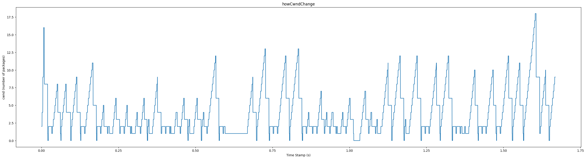
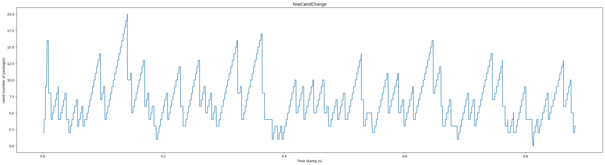

[TOC]

# 实验十八实验报告
+ 杨宇恒 2017K8009929034

**摘要：本实验实现了拥塞控制机制，获取拥塞窗口随时间的变化图。**

## 实验内容
实现拥塞控制需要三部分，1）根据ack的序列号以及是否超时来动态得到拥塞窗口大小；2）根据拥塞窗口限制数据报发送速度；3）快重传机制。

## 顶层架构设计
为了使代码更加清晰，我们在`congestionsControl.cpp`中实现`congestionControl`类。它会1）读入ack信息来维护拥塞窗口大小，2）提供拥塞窗口大小给`TCPProtocol`对象，3）适时地通知`TCPProtocol`对象进行快速重传。

## 内部实现细节
### 读入ack信息来维护拥塞窗口大小
`TCPProtocol`对象在处理每个数据报的时候调用这三个`congestionControl`对象的函数：
+ congestionControl.dupack(ack): 判断是否为重复确认，记录重复确认次数，并在三次重复确认时挑中cwnd和ssthresh。
+ congestionControl.successTransfer(ack): 在成功传输的时候增加cwnd。
+ congestionControl.checkRecovery(ack): 判断是否可以退出快恢复阶段。

### 提供拥塞窗口大小给`TCPProtocol`对象
在`tcp_sock_write`函数中，增加了拥塞窗口与重复确认数对是否发包的影响。

### 适时地通知`TCPProtocol`对象进行快速重传
在`TCPProtocol`对象在处理每个数据报的时候，congestionControl.dupack(ack)会返回bool值说明是否需要快速重传，congestionControl.successTransfer(ack)会返回bool值说明是否是快恢复阶段的particalACK进而需要重传。`TCPProtocol`对象会结合这两点进行数据报重传。

## 实验测试

### 环境配置
实验中的拓扑为两个主机节点通过一个路由器相连，链路有2%的丢包率。我们为文件传输应用进行两次次实验。第一次不使用快速重传，第二次使用快速重传。将整个传输时间下的拥塞窗口值作图。

### 实验测试过程
上图为不使用快速重传，下图为使用快速重传。

有下面几点发现：
+ 使用快速重传几乎将传输时间缩短了一半。
+ 使用快速重传明显减少了慢启动的发生。
+ 使用快速重传将拥塞窗口维持在合适的范围内。

## 总结
本实验实现了拥塞控制机制，获取拥塞窗口随时间的变化图。
