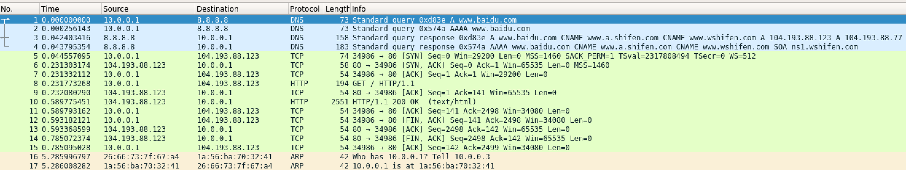
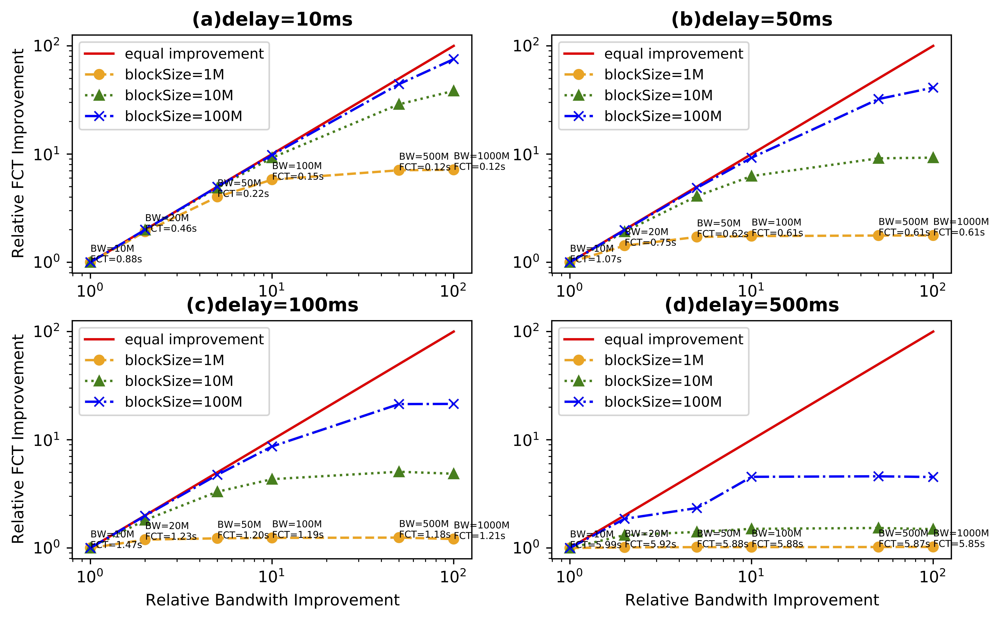

[toc]
# 实验一实验报告
+ 杨宇恒  2017K8009929034

## 实验环境
在MacOS系统上使用vagrant脚本在vbox中运行ubuntu18。

### vagrant管理软件介绍
vagrant提供一种环境配置的描述接口，用户通过这种描述，可以一键完成虚拟机镜像的下载、虚拟机属性配置（i.e., cpu个数、网络连接模式）、依赖包的安装、虚拟机相关文件的创建和清除、以及虚拟机的登陆。

### 实验过程
1. 从vagrantHub选择原始ubuntu18作为基础2
2. 配置足够的内存（4096MB）和cpu（4个）
3. 设置apt-fast 和 代理加速
4. DEBIAN_FRONTEND=noninteractive apt-fast install \
	+ wireshark \
	+ mininet xterm python3-pip \
	+ xauth # x11 forward \
	+ && pip3 install numpy matplotlib
5. vagrant中开启ssh连接的x11 forward

### 代码细节与结果
实验环境的全部代码在`./Vagrantfile`, `bootstrap.sh`, `bootalways.sh`中。可在`./`中使用`vagrant up`创建环境。额外注意，环境中`python`为python2，而`python3`为python3。

### 讨论：环境优势
+ 方便在笔记本上的测试，与台式机上运行更多实验。
+ 可以在任何装有vagrant、vbox5.2、git的地方一键完成实验。

## 互联网协议实验
解释使用wget下载页面过程中使用的协议。

### 实验过程
参照课件，在mininet中，打开节点的shell，使用后台运行的wireshark监测wget的行为。

### 代码细节与结果
完全使用课件中代码，wireshark结果保存在`./lab1/report/wiresharkOutput.pcapng`中，主要信息截图如下。


<center>Figure 1: Wireshark output.</center>

### 讨论：每个协议的含义
+ DNS: 客户机和域名解析服务器间通过Domain Name System(DNS)应用层协议通信，传输解析域名到IP地址的请求和结果。
+ TCP: 客户机和服务器间通过Transmission Control Protocal(TCP)传输层协议通信，传输关于传输连接状态的信息。
+ HTTP: 客户机和服务器间通过Hypertext Transfer Protocol(HTTP)应用层协议通信，传输应用需要的文本信息。
+ ARP: 路由器和客户机间通过Address Resolution Protocol(ARP)数据链路层协议通信，传输解析IP地址到MAC地址的请求和结果。

### 讨论：协议间的关系
1. 首先客户机10.0.0.1向域名解析服务器8.8.8.8请求解析`www.baidu.com`的IPv4和IPv6地址，得到了2个IPv4地址(104.193.88.123, 104.193.88.77)和0个IPv6IP。
2. 客户机选择104.193.88.123进行传输。在3次TCP握手后建立通道，进行了两次HTTP传输，并且每次传输有TCP的传输成功确认，最后通过4次TCP握手关闭通道。
3. 路由器10.0.0.3最后用ARP协议获得了客户机的MAC地址，进行缓存。

## 流完成时间实验
客户机与服务器间通过HTTP协议传输数据，探究带宽对流完成时间的增益效果。

### 实验过程与代码细节
全部实验过程由python完成，通过在`./lab1`目录下运行`sh run_all.sh`可以从生成传输数据、至汇总数据、最后生成带宽对流完成时间增益图。
1. 将课件中python模版修改为非交互方式，将日志设置不同的路径与文件名称。同时也为传输的文件设置不同的路径与名称，方便并行部署实验。代码对应 `./lab1/src/lib/getRawLog.py`, `./lab1/src/lib/getName.py`
2. 将实验参数(i.e., bw, , delay...)在单独文件中方便管理，代码对应, `./lab1/src/config.py`
3. 根据参数使用python的multiprocessing库并行运行`getRawLog.py`，每次运行对应一组参数。代码对应`./lab1/src/step1-generateAllRawLog.py`。
4. 从日志文件中提取流完成平均速率，将数据汇总到`./lab1/src/summayResult.json`中。代码对应`./lab1/src/step2-summaryRawLog.py`。
5. 将汇总数据制图到`./lab1/plot/Result.pdf`。代码对应`./lab1/src/step3-plotResult.py`。
+ 额外注意，除了用到mininet库的`./lab1/src/lib/getRawLog.py`文件为python2以外，均使用python3。所用脚本均需要`./lab1`目录下运行。

### 实验结果

#### 预实验：采用课件中参数实验

本部分使用的参数为：

```python
config = {
  'trial' : 5,
  'delay_all' : ['10ms', '50ms', '100ms', '500ms'],
  'block_all' : ['1M', '10M', '100M'],
  'bw_all' : [10, 50, 100, 500, 1000]
}
```

Fig2 显示了在四种延迟下的的带宽对流完成时间的增益效果， 可见当带宽增大后流完成时间明显受限于其他未知因素，对其受限因素进行了如下分析：

+ 检查磁盘读写，发现虽然流传输涉及文件读写，但没有磁盘访问，因此文件完全被内存缓存，排除此因素。
+ 检查mininet参数，由于默认情况下mininet对节点性能没有限制，并且cpu明显利用率低，排除此因素。

由于虚拟机环境对常规程序性能损失一般很小，进一步分析本测试程序不同于常规程序之处。一个明显的程序特征是连续的网络包中断，这所带来的中断处理性能与其包含的线程切换代价，是在常规程序中少有的。因此，虚拟机对此过程的性能代价要比常规程序低很多，可能是流完成时间的受限因素。

实际上，本实验没有进一步验证这一猜想，甚至没有定量地分析这一猜想的合理性，而是试图通过整体地成倍降低带宽来消除虚拟机性能瓶颈。

 

<center>Figure 2: <b>Raw</b> FCT improvement result with configuration <b>2</b> in config.py on <b>MacOS laptop</b>. (X-axis is 10 times of it should be)</center>

#### 选取低带宽参数，消除虚拟机性能瓶颈

```python
config = {
  'trial' : 5,
  'delay_all' : ['10ms', '50ms', '100ms', '500ms'],
  'block_all' : ['1M', '10M', '100M'],
  'bw_all' : [10, 20, 50, 100, 500, 1000]
}
```

由于低带宽下程序运行时间较长，使用笔记本运行不方便，但得益于实验环境的搭建以及自动执行脚本，实验轻松迁移到台式机运行。Fig3 显示了最终的四种延迟下的的带宽对流完成时间的增益效果。额外注意的是，在linux台式机中运行虚拟机，先前的虚拟机瓶颈也有所消除。
 

<center>Figure 3: FCT improvement result with configuration <b>4</b> in config.py on <b>Ubuntu desktop</b>.</center>

### 讨论：带宽对流完成时间增益的影响因素
1. 以50ms传输时延为例，大文件的传输可以从带宽获得更大的增益。这是由于大文件的流完成时间受发射时延主导，而增加带宽可以减小发射时延。
2. 对比四种传输时延，传输时延小时，文件传输可以从带宽获得更大的增益。这是由于传输时延小时，流完成时间受发射时延主导。
3. 特别地，我们关注500ms延时中文件大小为1M的曲线。曲线上的每一点流完成时间都约为6秒，这与我对其流完成时间几乎等于传输延时的预测不符，但结合[*互联网协议实验*](#互联网协议实验)中对HTTP协议的分析，这是由于传输文件需要两者间的多次通信，并且这些通信有部分先后依赖关系。

