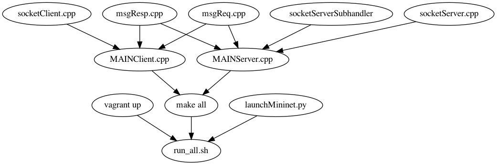

[toc]
# 实验三实验报告
+ 杨宇恒  2017K8009929034

## HTTP 客户端与服务端的C实现
使用C语言分别实现HTTP客户端的GET请求，以及服务端200 OK 与404 File not found两种相应回复。进一步，服务端需要串行、并行的服务多个客户端。

### 实验过程
尽管课堂介绍了获取数据包的C接口，但很难理解，因为对于这些接口输出没有概念，具体来说，我并不知道这些接口会返回类型是结构体、数组？，内容是十六进制流、ASCII流？，单个结构、多个需要拼接的结构？因此，需要进一步查阅HTTP协议内容，才能够理解为什么存在这些接口。
+ 在百度的一些结果中，可以知道接口的返回内容只是应用层的内容。这样，消除了需要结合传输层细节分析接口的顾虑。
+ 在`wireshark`观察`wget`和`python -m SimpleHTTPServer 80`交互过程中，看到了数据包包含很多属性信息。这样，对于哪些属性信息是必要的，疑惑增加了。
+ 在阅读frc官方文档之后，明白了传输过程中的客户端、服务端、中继的角色，进一步明确了http建立在传输层之上。这样，我可以主要关注客户端需要什么样的服务，意识到数据包中的必要属性一定是和所需服务紧密结合的。
+ 在参看国外某课程实验讲义后，明确了必要信息，可见，**对于HTTP协议内容的详细介绍对于本次实验是必不可少的**。

最初的代码实现从简单出发，实现数据包的字符串-结构体转换。进一步配合`wget`和`python -m SimpleHTTPServer 80`测试自己的一端单次请求。在自己实现的客户端服务端完成单次请求后，将测试集写入mininet的python接口中，完善了代码框架与验证结构。最后，拓展服务端功能实验串行、并行服务。

### 代码细节

Figure 1: Code structure

Fig1 展示了全部代码结构，最底部的`run_all.sh`首先使用`vagrant up`下载、配置环境，之后使用`make all`编译代码，最后运行`launchMininet.py`中的测试程序，结果输出在`lab3/result`目录下。

其中，C文件的功能为：
+ `msgResp.cpp`和`msgReq.cpp`实现了消息字符串-消息结构体的转换
+ `socketClient.cpp`和`socketServer.cpp`抽象了细节的socket接口，向main提供了简单的初始化、发送、接收函数接口。
+ 额外的，`socketServerSubhandler.cpp`处理单个用户端的请求，这为多线程服务提供了便利。特别地，每个服务设置了10秒延时，这可以区分串行、并行响应的区别。
+ 在`main`函数中使用`pthread`开启多线程。

测试程序集包括：
+ TEST1 myClient to myServer
	+ a. continuous request
	+ b. parallel request, to check the correctness, all requests finish at the same time.
	+ c. File not found
+ wgetClient to myServer
	+ a. continuous request
	+ b. parallel request, to check the correctness, all requests finish at the same time.
	+ c. File not found
+ TEST3 myClient to pythonServer
	+ a. continuous request
	+ c. File not found

### 实验结果
这里汇总了`lab3/result`中的关键细节。

+ 文件存在时，获得test_receiver\*.txt文件，否则，收到404。
+ 3次串行请求回复间隔10秒，3次并行请求回复间隔0秒。
+ 与`wget`和`python -m SimpleHTTPServer 80`顺利交互。
