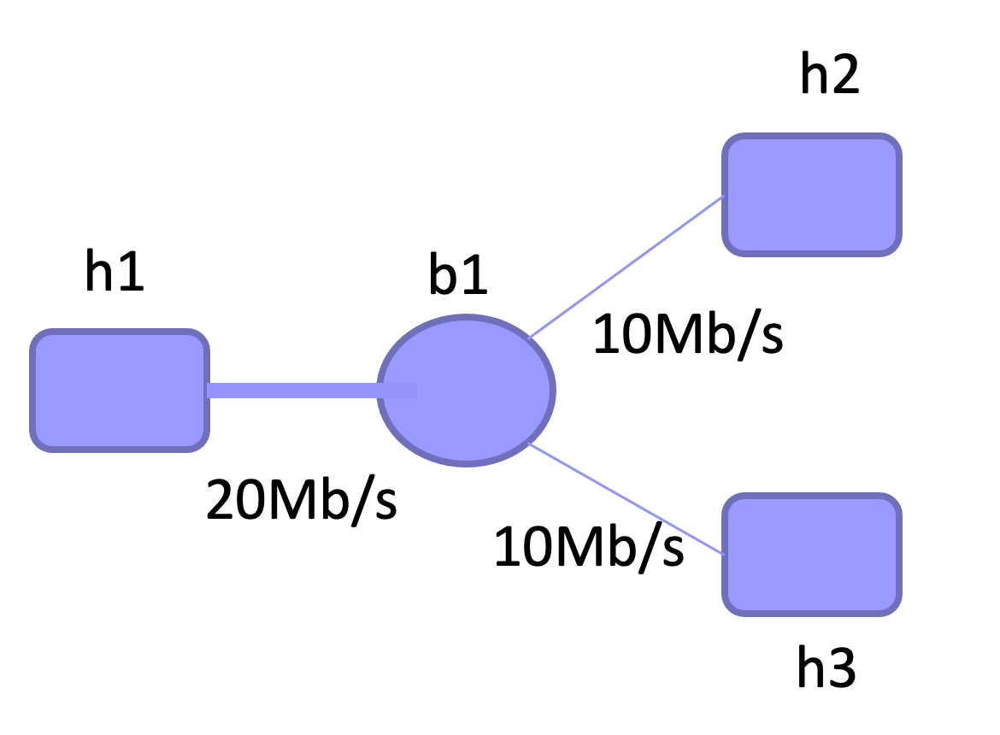
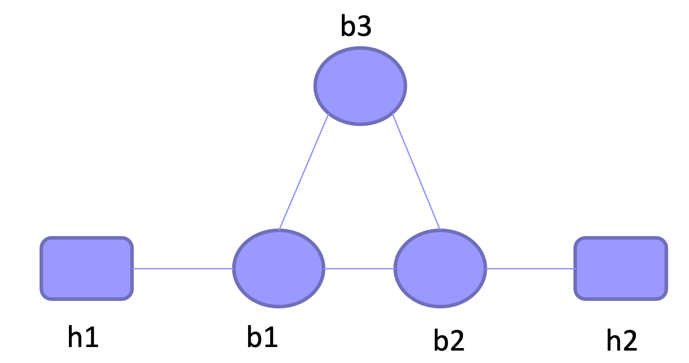
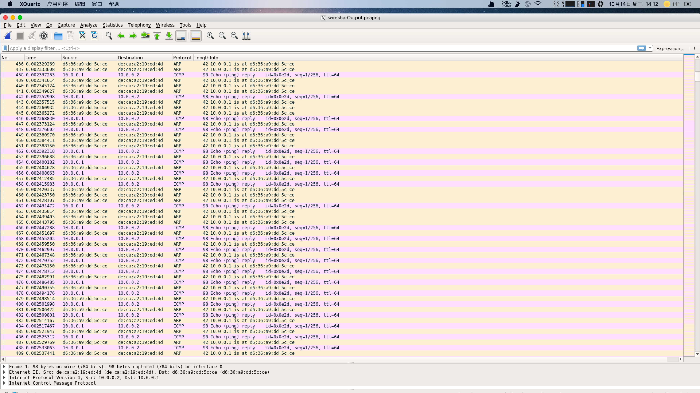

[TOC]

# 实验四实验报告
+ 杨宇恒 2017K8009929034

## 实现节点广播网络
阅读代码框架，实现其中的broadcast_packet函数，并验证两个节点可以通过hub相连并`ping`

### 实验过程与代码细节
+ 调用链表相关函数，值得注意的是，这种链表实现的优势在于
	+ 各种数据结构都可以复用，这是与C++等语言中已有的封装。
	+ 同一个数据结构可以同时在多个链表中。
	
	同时，不方便的地方在于，为了创建一个链表，我们需要同时在链表元素的数据结构中定义，并在函数中定义链表。即便他们可以使用相同的名字来使逻辑更加清晰，但为了实现一个功能而在两个位置进行修改引入了复杂性，理想的情况是指在函数中定义便可使用。
	
+ 广播时注意不要向发送方广播。
+ 补全`./lab4/src/main.c`

### 实验结果
`ping`的调用在`./lab4/mininet/three_nodes_bw.py`中，结果保存到`./lab4/result/STEP1-pingSuccess.log`中 

## 探究广播网络的效率
在如下图的网络结构和带宽限制下，对比两种负载时的最大传输效率。
+ h1同时向h2、h3发送不同的数据
+ h2、h3同时向h1发送数据

### 实验结果
在`./lab4/mininet/three_nodes_bw.py`中完成实验脚本、进行10Mb传输，结果保存到`./lab4/result/STEP2-*.log`中 ，下面的表格汇总了结果。

|                        | h1与h2间速率 | h1与h3间速率 |
| ---------------------- | ------------ | ------------ |
| h1同时向h2、h3发送数据 | 3.13 Mb/s    | 3.20 Mb/s    |
| h2、h3同时向h1发送数据 | 6.09 Mb/s    | 6.13 Mb/s    |

可以看到第一种情况下速率更低，这是因为，以h1与h2之间传输为例，h2为了收到数据，不得不同时接收两份数据，抛弃一半而只接受属于自己的数据。
而对于第二种情况，同样以h1与h2之间传输为例，虽然h1发出的数据仍然被广播了两份，但其中一份发向h3，并不会影响任何数据的正常传输。

## 组建环形拓扑并观察数据环路
在python中实现如下图的网络结构，观察h1向h2发包时，数据包在三个hub间产生环路。

###  实验结果
在`./lab4/mininet/hub_loop.pu`中实现结构，运行`ping -c 1`发送一个包，并调用`tshark -c 10000`，发现可以连续抓取10K个数据包，生成的wireshark输出片段如下：

