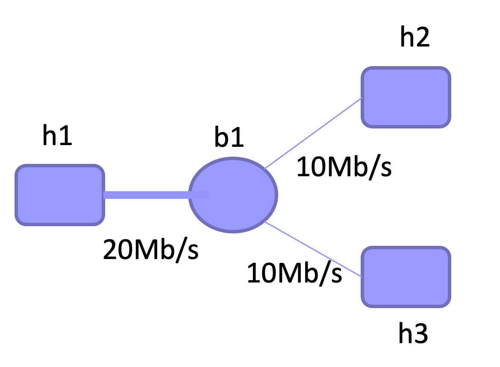

[TOC]

# 实验五实验报告
+ 杨宇恒 2017K8009929034

## 实现交换机
阅读代码框架，实现其中的TODO函数，并验证两个节点可以通过hub相连并`ping`

### 实验过程与代码细节
+ `./lab5/src/main.c/handle_packet`
	根据目标表项是否存在进行转发或广播，根据源表项是否存在更新或插入转发表项。
+ `./lab5/src/package.c/broadcast_packet`
	对每个非源接口进行发送。
+ `./lab5/src/mac.c/lookup_port`
	通过hash索引到对应链表，在其中查找mac地址对应的接口，并更新时间戳。
+ `./lab5/src/mac.c/insert_mac_port`
	通过hash索引到对应链表，在堆空间中新建一个表项并插入链表中。
+ `./lab5/src/mac.c/sweep_aged_mac_port_entry`
	对于每个链表，对其中每个元素，检查时间戳是否超时，如是，则移除表项并释放空间。

### 实验结果
`ping`的调用在`./lab5/three_nodes_bw.py`中，结果保存到`./lab5/result/STEP1-pingSuccess.log`中。

## 探究交换网络的效率，并与集线器网络对比
在如下图的网络结构和带宽限制下，对比两种负载时的交换网络的最大传输效率，并与集线器网络对比。
+ h1同时向h2、h3发送不同的数据
+ h2、h3同时向h1发送数据

### 实验结果
在`./lab5/three_nodes_bw.py`中完成实验脚本、进行10Mb传输，结果保存到`./lab5/result/STEP2-*.log`中 ，下面的表格汇总了结果。

|                        | h1与h2间速率 | h1与h3间速率 |
| ---------------------- | ------------ | ------------ |
| h1同时向h2、h3发送数据 | 9.51 Mb/s    | 9.51 Mb/s    |
| h2、h3同时向h1发送数据 | 7.35 Mb/s    | 7.28 Mb/s    |

对比上一次实验中关于hub网络的结果如下图：

|                        | h1与h2间速率 | h1与h3间速率 |
| ---------------------- | ------------ | ------------ |
| h1同时向h2、h3发送数据 | 3.13 Mb/s    | 3.20 Mb/s    |
| h2、h3同时向h1发送数据 | 6.09 Mb/s    | 6.13 Mb/s    |

可以看到对于交换网络，两种传输方式都可以接近带宽极限。值得注意的是尽管client只向server发送数据，server也会进行确认回复，因而最终每个mac地址都会存在于转发表中。

对于第二种情况较慢的现象，并没有进行详细分析，但这可能函数性能相关，因为实验过程中最初在`./lab5/src/main.c/handle_packet`函数中忘记判断表项是否存在，当时的结果显示第二种情况仍可以得到9Mb/s的速度。当然，需要进一步重复，并调整函数观察速率变化，才能最终确认函数性能到底是否影响。

对比集线器性能，交换机减少了广播而有相对更高的性能。

## 思考题

### 网络中存在广播包，即发往网内所有主机的数据包，其目的MAC地址设置为全0xFF ，例如ARP请求数据包。这种广播包对交换机转发表逻辑有什么影响？
将目的MAC地址设置为全0xFF非常巧妙，一致地利用了转发表的常规逻辑，自然地实现了广播。关键点在于，永远不会有全0xFF的地址向交换机发包，因为这个max地址不会出现在转发表中，于是这个数据包永远会被广播。

### 理论上，足够多个交换机可以连接起全世界所有的终端。请问，使用这种方式连接亿万台主机是否技术可行？并说明理由。
+ 理论课已经详细介绍，自适应路由算法不具备可拓展性，具体来说，通过生成树算法选举根节点的方法，所需更新轮次，正比于网络半径上界。
+ 理论课详细介绍，广播在大网络中是不可行的。
+ 此外，交换网络难以处理终端的实时加入，因为生成树算法需要在网络变动后重新运行。
+ 最后，当终端出错时，由于转发图为无环图，会导致很多节点间变得不可达到。

