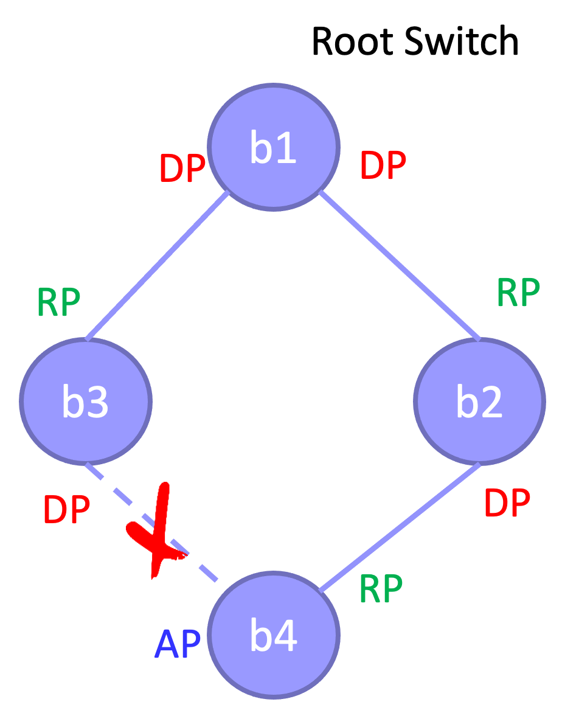
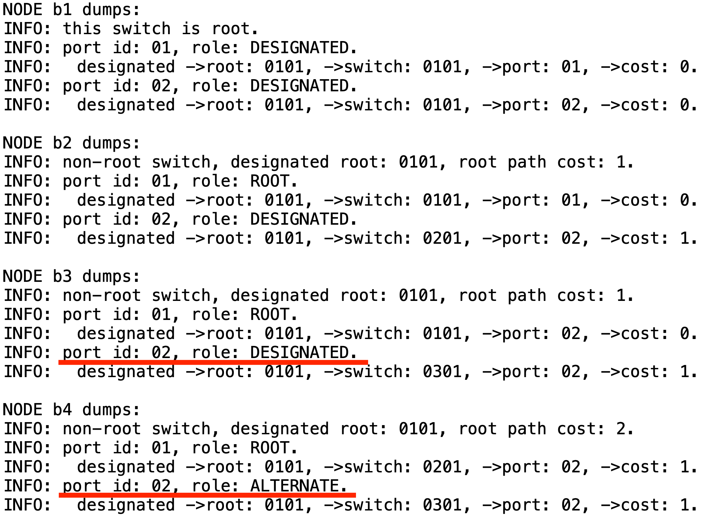
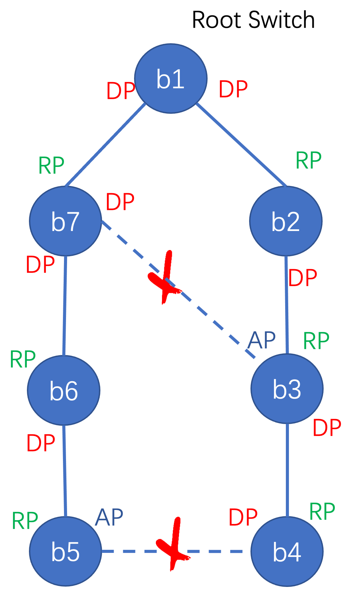

[TOC]

# 实验六实验报告
+ 杨宇恒 2017K8009929034

## 实现生成树算法
阅读代码框架，根据课件，实现`./lab6/src/stp.c`中的`stp_handle_config_packet`函数。

### 实验过程与代码细节
课件15-18页详细列出了需要实现的功能，这里列出其中不完善的两点、以及不正确的一点。
+ 注意在读取数据包中的config内容时，需要进行相应的字节序转换。
+ 由于在18页中指出，“如果一个端口为非指定端口，且其Config较网段内其他端口优先级更高，那么该端口成为指定端口“。我们需要记录网段内其他端口的信息，才能进行优先级比较。我使用的解决方式是，每当一个端口收到一个数据包的时候，就把这个数据包储存在端口结构体中。这样，当需要对这个端口和网段内其他端口优先级进行比较的时候，就可以将这个端口与结构体中储存的数据包进行比较。直观上，这种实现并不一定在所有情况下都是正确的，并且没有考虑网段内有多个其他端口的情况，但由于在多次实验中没有出现错误，就还可以。
+ 在我的实现中，并不能依照课件中的部分在于，与上一条相同的位置，“如果一个端口为非指定端口，且其Config较网段内其他端口优先级更高，那么该端口成为指定端口“。当进行优先级比较的时候，我们不能直接使用这个节点的这个非指定端口的信息和网段中其他端口。而需要先假定这个非指定端口为指定端口并进行信息的更新，之后再和网段中其他端口比较。如果可以将该端口转换为指定端口，则前面假定的更新是合适的；否则，需要回退上述更新。这样做的原因是，如果我们不做这个假定的更新，非指定端口的信息一定是依赖于同网段中那个优先级最高的端口的，这样，我们其实没有机会让这个非指定端口成为指定端口。

## 测试结果
在.`./lab6/`目录下运行`bash run_all.sh`会运行在`./lab6/mininet/`中两个python文件定义的四节点网络与七节点网络，运行结果生成在`./lab6/result/`中。

### 四节点环路测试
测试网络为：

这里解释网络中重要的部分，并在下面的结果中用红线标出：
+ 图中被计算成冗余的链路是值得分析的。首先分析冗余的产生，节点4在选择根路径的时候，会从代价相同的3号节点方向和2号节点方向中，选择出ID值更小的2号节点方向。其次分析冗余链路两个端口的类型，由于3号节点可以为这条链路提供更近的根路径，于是路径会从3号节点的端口出去。

测试结果为：

### 七节点网络测试
测试网络为：

这里解释网络中重要的部分，并在下面的结果中用红线标出：
+ 底部的冗余链路的形成是因为，首先，4号和5号节点都有各自到根节点的最短路径，于是形成冗余链路。其次虽然冗余链路从4号和5号节点前往根节点有相同的距离，4号节点有更小的ID值，于是4号节点上的端口为指定端口。
+ 上部的冗余链路形成是因为，首先，7号节点有自己到根节点的最近路径；对于3号节点，虽然向7号和2号节点两个方向到根节点有同样的距离，2号节点有更小的ID值，于是形成冗余链路。其次，冗余链路经过7号节点可以更短的到达根节点，于是7号节点上的端口为指定端口。

测试结果为：

