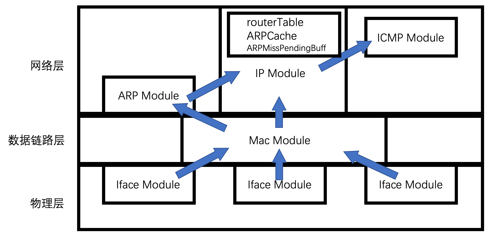

[TOC]

# 实验七实验报告
+ 杨宇恒 2017K8009929034

**摘要：本实验报告首先，分析了原有框架中，以“文件结构与模块抽象”为代表的一些难以阅读的问题。进而，通过对路由转发功能逻辑进行分析，使用（a）与网络体系结构相同的模块划分方式，（b）一致的模块接口与功能定义；提供了一个对于路由转发简洁的思考思路。作为实验的主要部分，我根据这一简洁的思考思路重构了代码框架。最终，详细描述了利用这个简洁的思考思路与新的代码框架，整个代码细节实现过程可以变得很清晰。**

## 代码框架阅读
实验框架代码比较难读，这里列出了我对代码的疑问和建议。

### 文件结构与模块抽象
其中，最主要的部分是下面关于文件结构和模块抽象的部分，这也是我希望通过重新整理代码而解决的问题（这不需要C++特性来解决）：
+ 文件结构复杂：如果有文件之间调用关系图，会更容易阅读。
+ 模块抽象1：希望增加单独的ether模块来处理mac头信息既能够进行模块的拆分，简化单独模块的逻辑。又能够在较低的层次处理iface信息，而不将iface传入IP层。并且这也是和理论课中网络体系结构分层相符合的。
+ 模块抽象2：mac、ip、arp、icmp最好能够有一致的模块功能和接口，即用相同的方式输入数据包，判断是否需要向下一层传输，最终向上一层或下一层传递数据包。而不是为了性能和减少代码量去取消mac层，取消icmp的handle接口。

### 函数的可见范围
其次，函数是私有还是全局可见也是造成我阅读代码困难的原因，即使不使用C++特性这也可以通过调整函数所在文件位置，或者在文件中进行private/public注释区分。但我还是决定使用C++来显式地对代码可见性进行区分。
+ 私有函数被全局可见1：当使用宏定义的时候，会出现是否使用宏嵌套的设计权衡，例如`ip.h`文件中的`HOST_IP_FMT_STR`，内部调用了宏`LE_IP_FMT_STR`。使用嵌套的优势是内层宏定义可以复用，但问题在于在阅读代码的时候会看到本文件的内层宏`LE_IP_FMT_STR`也成为了全局可见的”函数“，没有实现代码模块的抽象。
+ 私有函数被全局可见2：类似 `ip.h`中的`ip_checksum()`是不是可以只放到`ip.c`中？

### 细节调整
最后，还有一些小的细节带来困惑
+ 同一种功能多个实现：同样用`ip.h`文件中的`HOST_IP_FMT_STR`，由于数据包中各个部分都需要字节序转换，IP的字节序转换应当和其他部分字节序转换使用相同的方式，而不是使用宏定义第二种字节序转换方式。
+ 命名不易理解1：例如`ip.h`文件中的`ip_init_hdr()`，其中的`init`容易让人联想到这是在`init_ustack()`过程中的调用，可以改成类似于`create_ip_header`。
+ 命名不易理解2：`rtable_internal`容易联想到是对rattle私有的操作，但实际更类似于`rtable_init`的功能。
+ 一致性对待：在所有包头信息中，只有mac地址没有被转换成int类型，而使用网络大尾短字节序（char[]类型），确实使用uint64储存48位的mac会有些麻烦，但我认为保证它与其他包头信息相同的处理，仍然会让mac处理稍微不特殊一些，进而也会减少隐藏的忘记转换的bug。
+ 快速理解代码：希望把待实现部分打印TODO的同时，打印这个函数的输入，例如打印待处理的数据包，这样可以让我更快的确认进行需要实现的处理。

## 重构代码目标
正如上面所述，我重写代码框架最希望解决的问题是：
+ 将模块划分与实际网络体系结构的逻辑相结合，每一层协议都可以避免底层细节信息传递到上层。而在上层希望控制底层传输的时候，也不需要讲过于细节的信息告诉下一层。
+ 让每个模块的接口函数更加一致，用相似的接口将数据包从物理层一步步调用handle函数向上传递，最后再使用相似的接口将数据包向下调用send函数。
+ 由于模块划分与实际网络体系结构一致，并且每个模块都有一致的处理接口，在调用关系图中不必显示不同的模块接口类型，可以用清晰的结构图来描述模块间的调用关系。

## 重构代码结构
这里，我结合最终画出的调用关系图，来依次介绍我是如何定义接口与功能的，以及如何划分各个协议的上下级关系的。图中的箭头是下级指向上级的。

### 接口与功能
对于每个模块，我一共实现了两个public接口函数，以及一组private功能函数。
1. `handlePacket`接口函数：
这个函数被下层模块调用，它的输入是本模块的数据包，以本模块的包头作为起始。同时，输入也包括下层拆包后读取的部分信息。这部分信息是必要的，因为本模块最终需要命令下层生成新的下层包头，而这部分信息则是生成这些包头的依据。但同时，好的网络体系结构应当保证这样的下层包头信息不会被向上传递很多层，理想情况是，上层应当只知道紧邻的下层的一些包头信息，而不需要知道更底层的包头信息。

2. `sendPacket`接口函数：
这个函数被上层模块调用，它的输入是上层模块的数据包，以上一层的包头作为起始。同时，输入也包括上层通知本层如何制造本层包头的指令。同样，好的体系结构可以保证上层的命令只对紧邻下层有效，不需要对更下面的层次的包头信息作出指令。

3. `handle*`私有功能函数：
一个模块除了需要将下层数据包解析给上层，以及将上层数据包封装给下层，还有些数据包需要在这一层被处理。我们让每个模块用这样的一致的方式区分需要传递的数据包handle和需要处理的数据包handle：当传递数据包的时候，我们在`handlePacket`接口函数中调用上一层的`handlePacket`接口函数；当处理数据包时，我们在`handlePacket`接口函数调用`handle*`私有函数。此外，我们需要思考当`handle*`需要发送数据包的时候，是调用同一模块的`sendPacket`接口函数进而向下一层发送数据包，还是自己直接向下一层发送数据包。我选择了前者，考虑到这两个因素：
	+ 在数据包发往下层之前，无论是本层产生的还是上一层产生的，都会进行一些相同的操作，例如IP层都需要根据IP查找路由表，于是选择前者可以增加复用。
	+ 使用前者时，可以将`handle*`看作一个虚拟的上层模块，这让整体逻辑更加简洁，因为我们无需将模块中的这些处理看作一个特殊的部分，而可以把他们当作一个单独的模块。这样可以划分更多的模块，进而使得每个模块的功能更加简单。

### 划分模块上下级关系
这里注意的是，虽然IP、ARP、ICMP都属于网络层协议，但我们仍然试图定一个上下级关系，使得他们我们更清晰的看到数据包的处理流程。为了能够定义上下级，我们需要定义下级对上级的汇报内容，以及上级对下级的命令内容。为了能够让我们的这两个定义适用于所有模块之间的交流，我们需要让汇报内容和命令内容包换足够多的组成部分，这样我们对于那些特殊的交流，我们可以认为他们只进行了汇报与命令的部分组成成分，进而把这些特殊的交流纳入到正常的汇报与命令范围内。

我们这样对交流内容作出定义：本模块对上级汇报的内容由两部分，其一是本模块对于下级汇报信息中除去上级数据包部分所进行的分析结果，其二是上级数据包本身。本模块对下级命令的内容也包括两部分，其一是本模块对上级命令信息中除去上级数据包部分所进行的阐释结果，其二是本级数据包。

下面的逐例分析可以进一步解释我们对汇报与命令的定义，要特别注意我们用NULL指出信息交流是缺省的，这极大的帮助我们将特殊的交流纳入我们的逻辑体系：
1. `iface`与`mac`：
	+ 汇报：ifaceIndex + mac数据包
	+ 命令：ifaceIndex + mac数据包
2. `mac`与`IP`：
	+ 汇报：NULL + IP数据包
	+ 命令：目的Mac，mac包类型，ifaceIndex + IP数据包
3. `mac`与`ARP`：
	+ 汇报：ifaceIndex + ARP数据包
	+ 命令：目的Mac，mac包类型，ifaceIndex + IP数据包
4. `ARP`与`IP`：
	+ 汇报：IP-mac映射 + NULL
	+ 命令：ARP包类型，源IP，目的IP，目的MAC（全1） + NULL
5. `IP`与`ICMP`：
	+ 汇报：源IP，IP头，错误类型和代码 + ICMP数据包(ping)/NULL(非ping)
	+ 命令：TTL，IP包类型，目的IP + ICMP数据包

值得注意的是，我们之前提到如果某一个模块直接将一个数据包使用`handle*`私有函数处理，而不上传到上一级，我们认为这个`handle*`私有函数是一个虚拟的上级。这样，这个模块和其虚拟上级之间的交流也应该符合我们对于汇报与命令的定义。

### 我们是如何确定ICMP是IP的上级的？
在和杨程远的讨论中，我们意识到这样的三个事实让我们难以区分ICMP和IP的上下级关系：
+ IP像是上级：IP进行了复杂错误类型和代码判断，而ICMP只是简单的按照错误代码添加ICMP包头。
+ ICMP像是上级：所有到达ICMP的数据包都需要先经过IP层，所有从ICMP发出的数据包也都需要先经过IP层。
+ 他们不像是有上下级关系：IP包头包了一个ICMP包头，又包了一个IP包头。

最终，我们认为第二点最为重要，因为我们发现了第二点等价的描述是：只有IP可以直接和mac层通信，ICMP不可以直接和mac层通行。其重要性在于，按照上面的调用关系图，IP由于可以和mac层通信，其模块紧靠网络层与数据链路层的分界线；然而ICMP由于不可以和mac层通信，直观上会将它远离网络层与数据链路层的分界线。这样，如果我们根据每个模块的下表面优先作为层级的判断，把ICMP放到更高层级更为合适。

### 我们是如何去确定IP是ARP的上级的？
由于ARP和IP都可以直接和mac通信，上面的区分依据并不可行。但实际上，将IP看作上级是比较显然的，因为IP明显根据自己路由表查询情况，决定是否发送ARP包。因此，在是否能与mac通信这一主要因素相同的情况下，IP是否进行了复杂的判断成为了区分层级的决定因素。

## 代码实现细节
整体上，为了快速完成框架的迁移，我仍然调用了原有框架的一些函数，但这些调用仅仅出现在`main.cpp`中，这方便了对新框架的初始化，而在此之后，其他文件均没有使用原有框架的内容。这样，当阅读新框架的时候，不需要了解原有框架的结构。

得益于新代码对每个模块有一致的接口，并且调用关系图清晰的描述了不同模块间的关系，我们只需要按照调用关系，依次描述接口的实现，就可以轻松地理解代码实现。这里再次强调新结构的优势：这个结构提供了一个清晰的思考代码功能的方式，即遍历每个模块，并对每个模块提出相同的三个问题，即如何根据下级汇报内容向上级或虚拟上级汇报，如何根据上级或虚拟上级命令对下级下达命令，以及考虑每个`handle*`私有函数如何将汇报转换成命令。

### 每个模块的数据结构
每个模块主要包含`struct header`来储存本模块的包头信息，按照本机字节序。

每个模块的函数包括四部分：
	+ [public]添加相邻的上下级模块指针的函数。以及添加主机mac、IP信息的接口，这些信息在`main.cpp`中从旧的框架中拷贝过来。
	+ [public]`handlePacket`函数，它被下级函数调用来向本模块汇报。`sendPacket`函数，它被上级函数调用来向本模块下达命令。
	+ [private]`handle*`函数，它是这个模块根据本模块的协议进行的处理，但我们将它理解成一个虚拟的上级，即它会像一个上级handle函数一样被本模块的调用以进行汇报，同时它会像上级一样调用本模块的send函数。
	+ [public]`debug_print*`函数，它打印本级的包头信息。

此外，有些模块还会有内部的数据结构，例如IP模块具有ARP缓存。值得一提的是，将ARP缓存放在IP模块是应为，ARP缓存控制了IP层是否需要发起ARP协议请求，这是IP层作出的一个决定。

### `etherPacketModule`
1. `handlePacket`接口函数：根据mac帧类型，向IP或ARP模块汇报。
2. `sendPacket`接口函数：根据ifaceIndex，命令物理层发包。

### `ARPPacketModule`
1. `handlePacket`接口函数：根据ARP帧类型，向IP或虚拟req模块汇报。
2. `sendPacket`接口函数：根据ifaceInde，x命令mac层发包。
3. `handleReq`私有函数：根据目的IP是否为本机，调用本级`sendPacket`

### `IPPacketModule`
1. `handlePacket`接口函数：根据TTL、目标IP地址是否为本机、目标IP地址是否路由表可查，向ICMP或虚拟forward模块汇报。
2. `sendPacket`接口函数：根据目的IP查询路由表，并根据下一跳IP查询ARPCache。根据查询成功与否以及查询结果，向mac或ARP模块下达命令。
3. `handleForward`私有函数：直接调用本级`sendPacket`。

### `ICMPPacketModule`
1. `handlePacket`接口函数：根据ICMP的code和type，调用RouterTableFail、或TTLZeroFail、或ARPFail、或PingResp虚拟模块。
2. `sendPacket`接口函数：根据code和type，命令IP层发包。
3.  `handleRouterTableFail`、`handleTTLZeroFail`、`handleARPFail`、`handlePingResp`私有函数：在堆上生成数据包，调用本级`sendPacket`。

### 需要进一步整理、实现的部分
目前，对于`ARPMissPendingBuff`功能的在整体结构上的还不够清晰，主要困难在于确定是否要将这部分功能放到一个单独的class中，并让IP模块实例化这个模块。其实对于`routerTable`和`ARPCache`都是使用这个方式，然而对于`ARPMissPendingBuff`，这种实现的缺点是，`ARPMissPendingBuff`内部需要进行的处理比较少，更多的是把IPpending的信息传入这个模块，以及将release的pending输出给IP。但由于这部分对于整体重构后的代码结构影响不大，目前没有作为优先功能实现。

相应的，我们除了主线程外，只安排了额外的一个线程来定期检查pending超时的数据包，发送目的节点不可达。而没有对进行ARP重传和ARPCache清理，也没有对目前的两个线程进行加锁处理（虽然得益于模块划分，加锁应该很简单）也是由于`ARPMissPendingBuff`尚未完整确定，并且这部分内容对于整体重构后的代码结构影响不大目前没有作为优先功能实现。

## 实验过程与结果
在`./lab7/mininet`文件夹中定义了网络，并设置了wireshark抓包、ping命令等指令，结果输出到`./lab7/result`文件夹中。使用`run_all.sh`可以从编译开始运行所有实验。

值得注意的是，在ssh连接虚拟机的时候，路由器节点似乎由于关闭了部分网络协议无法使用x11 forward打开xterm以及wireshark窗口，甚至命令行工具tshark也会返回找不到r1-eth0接口，因此目前还无法对路由器节点进行抓包。当然完全使用虚拟机的图形界面是一个可能的解决方式，但如果能够在命令行实现抓包还是更方便的。

## 总结
本实验报告首先，分析了原有框架中，以“文件结构与模块抽象”为代表的一些难以阅读的问题。进而，通过对路由转发功能逻辑进行分析，使用（a）与网络体系结构相同的模块划分方式，（b）一致的模块接口与功能定义；提供了一个对于路由转发简洁的思考思路。作为实验的主要部分，我根据这一简洁的思考思路重构了代码框架。最终，详细描述了利用这个简洁的思考思路与新的代码框架，整个代码细节实现过程可以变得很清晰。此外，尚有两个问题需要进一步解决：（a）如何将`ARPMissPendingBuff`更好的融入代码实现中，（b）如何对路由器节点使用命令行抓包。

